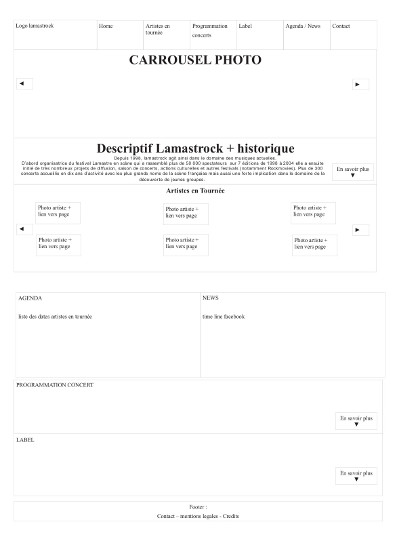

# A - Refonte du site de Lamastrock

===

## 1 - Maquéter une application
///
Le site de Lamastrock en Wordpress n'était pas responsive design et ne pouvait pas être upgrader sans casser des dépendances, il fallait le reconstruire.

Nous avons proposé des maquettes avec Balsamiq puis sur des feuilles A5 avec comme ligne directrice de réunir différentes pages sur la page d'accueil pour éviter d'avoir à naviguer dans plusieurs pages.
///

Note: Je n'ai pas garder de version des wireframe avec Balsamiq, après version d'essai, j'ai supprimé ce logiciel privateur.
///
Nous nous sommes mis d'accord sur deux mises en page pour l 'accueil et pour les artistes. Nous avons choisi de garder la charte graphique d'une designer qui avait établi une maquette pour un événement culturel organisé par Lamastrock , TerraTempo, en reprennant entre autres les codes des couleurs et des polices.
///

///
J'ai mis en place sur le lieu de formation une machine serveur avec une distribution **Mageia**, la configuration de **Apache** + **Lamp** + **Mysql** pour y installer un framework **Wordpress** en local qui est devenue notre outil de travail et d'élaboration en intranet.
///
Configuration pour Apache pour utiliser un dossier public_html en local


```
<IfModule mod_userdir.c>
        UserDir public_html
        UserDir disabled root
        <Directory /home/*/public_html>
                AllowOverride FileInfo AuthConfig Limit Indexes
                Options MultiViews Indexes SymLinksIfOwnerMatch IncludesNoExec
                <Limit GET POST OPTIONS>
                        Require all granted
                </Limit>
                <LimitExcept GET POST OPTIONS>
                        Require all denied
                </LimitExcept>
        </Directory>
</IfModule>
```

Note: /etc/apache2/mods-enabled/userdir.conf
///
Pour utiliser php5 en local

```
<IfModule mod_php5.c>
    <FilesMatch "\.ph(p3?|tml)$">
        SetHandler application/x-httpd-php
        Require all granted
    </FilesMatch>
    <FilesMatch "\.phps$">
        SetHandler application/x-httpd-php-source
        Require all denied
    </FilesMatch>
    # To re-enable php in user directories comment the following lines
    # (from <IfModule ...> to </IfModule>.) Do NOT set it to On as it
    # prevents .htaccess files from disabling it.
    #<IfModule mod_userdir.c>
    #    <Directory /home/*/public_html>
    #        php_admin_value engine Off
    #    </Directory>
    #</IfModule>
</IfModule>
```
Note: etc/apache2/mods-available/php5.conf 

===
## 2 – Concevoir une base de données
///
J'ai  ensuite déposé une version récente de Wordpress. Créé une base de données et un utilisateur pour cette base de données avec phpMyadmin.
```
mysql> CREATE DATABASE lamastrosql CHARACTER SET utf8 COLLATE utf8_unicode_ci;
```
```
mysql> CREATE USER 'lamastrock'@'localhost' IDENTIFIED BY 'monsupermotdepasse';
GRANT SELECT,INSERT,UPDATE,DELETE, CREATE ON *.* TO 'lamastrosql'@'localhost';
```

///

Une fois le dossier Wordpress déposé sur le serveur dans le dossier public_html, on édite le fichier wp-config-php avec les identifiants et le nom de la base de données à utiliser.

```
// ** Réglages MySQL - Votre hébergeur doit vous fournir ces informations. ** //
/** Nom de la base de données de WordPress. */
define('DB_NAME', 'lamastrosql');

/** Utilisateur de la base de données MySQL. */
define('DB_USER', 'lamastrock');

/** Mot de passe de la base de données MySQL. */
define('DB_PASSWORD', 'lamastrockv4');

/** Adresse de l'hébergement MySQL. */
define('DB_HOST', 'localhost');

/** Jeu de caractères à utiliser par la base de données lors de la création des tables. */
define('DB_CHARSET', 'utf8');

/** Type de collation de la base de données.
  * N'y touchez que si vous savez ce que vous faites.
  */
define('DB_COLLATE', '');
```

Note: public_html/wordpress/wp-config-php

///
Pour pouvoir installer des extensions et des thèmes sans passer par ftp sur le serveur local.

```
$ sudo chown -R nom_utilisateur_apache: wordpress
```

Note: suivant la configuration le nom de l'utilisateur de apache peut être différent (www-data apache ou daemon).

===
## 3 – Mettre en place une base de données
///
J'ai importé les tables de la base de données de l'ancien site que m'a envoyé le webmaster avec phpMyadmin.
``` 
mysql -u root -p -h localhost lamastrosql < /home/lamastrock/lamastro.sql
```
///
J'ai choisi de créer un thème enfant Lamastrockv4 pour personnaliser le site.

```
/*
 Theme Name:     Customizr Child
 Theme URI:      http://lamastrockv4.deploiement.ovh/
 Description:    Theme enfant pour lamastrock
 Author:         Rodolphe Robles
 Author URI:     https://www.rodinux.fr/
 Template:       customizr
 Version:        1.0.0
*/
```
Note: public_html/wordpress/wp-content/themes/lamastrokv4/stylesheet.css
///
J'ai développé le css et mis en place les extensions qui allaient être utiles, customisé le thème de Gigpress avec un nouveau fichier gigpress.css et changé quelques attributs du thème parent pour avoir la taille voulue des images dans le Slider de la page principale.
```
add_filter( 'tc_thumb_size', 'my_thumb_size');
function my_thumb_size() {
     $sizeinfo = array( 'width' => 1200 , 'height' => 500, 'crop' => false );
     return $sizeinfo;
}
```
Note: public_html/wordpress/wp-content/themes/lamastrokv4/functions.php
///
J'ai mis en place une fonction loop (une boucle) en php avec un shortcode, en utilisant l'extension Shortcode Ultimate, pour prendre automatiquement les images mises à la une d'un article des catégories «artistes» dans des étiquettes sur la page principale d'Accueil.
```
[su_posts template="templates/teaser-loop.php" posts_per_page="18" width="300" height="120" tax_term="5" tax_operator="0" order="desc" orderby="date"]
```
///
J'ai ensuite mis en place le travail effectué sur un hébergement mutualisé d'OVH afin de travailler à distance de manière agile avec le client.

===
### 4 – Développer une interface Utilisateur 
### 5 – Développer des composants d'accès aux données
///
Pour cet exemple, je n'ai pas eu grand-chose à faire, puisque le framework Wordpress inclut le nécessaire pour administrer le site. 
La seule particularité est dans le fait qu'il soit devenu un multi-site ce qui implique que je suis le seul à avoir accès aux permissions de super-administrateur pour  rajouter des extensions ou des thèmes, les activer ou non sur le site, faire des mises à jour ou bien rajouter un site. 
Ceci permet une sécurité supplémentaire et demande aussi une maintenance et une vigilance assez régulière. 

