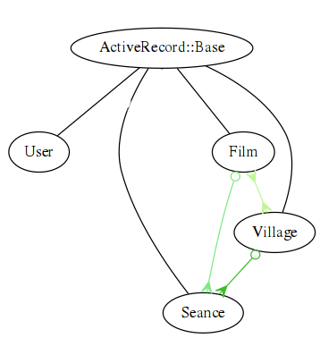
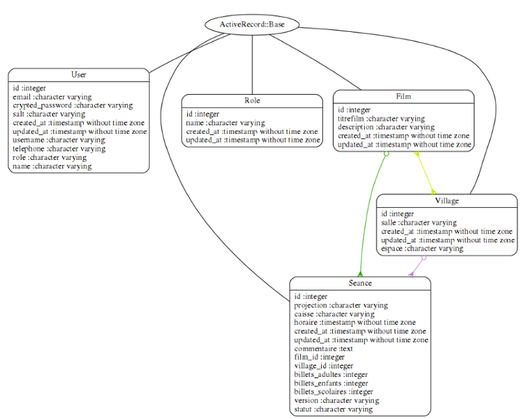
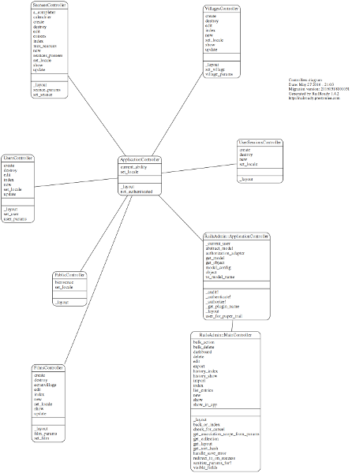

# B – Développement de l'application Plannings
===
## 1- Maquetter une application
J'ai décidé dès le départ que je voulais arriver à plusieurs vues de calendriers par lieux, pour faciliter l'édition des bénévoles. J'ai créé une application avec Ruby on Rails en utilisant rvm qui permet d'avoir plusieurs versions de Rails sur sa machine
///
```
$ rails new plannings_ecranvillage
$ rake db:migrate
```
Note: Les premières commandes pour créé une application avec rails 
///
Mon idée avant tout était de me mettre à la place du bénévole qui s'inscrit pour être projectionniste ou pour faire la caisse pour une séance. Comme l'association Écran Village diffuse des films dans divers lieux régulièrement en plus de l'itinérance, ma préoccupation était de facilement choisir sa disponibilité en fonction du   lieu, puisque c'est la première chose que regarde un bénévole, les séances ayant cours dans son lieu proche.
///
J'ai pensé que j'avais besoin de quatre tables principales, la table User des utilisateurs, la table Seance des séances, la table Film pour les films et la table Village pour les lieux.
```
$ rails g scaffold User name:string                       
$ rails g scaffold Film titrefilm:string descripton:string
$ rails g scaffold Village salle:string espace:string
$ rails g scaffold Seance horaire:date lieu:string projection:string caisse:string
```
Note: Ceci était les débuts de la réalisation de l'application, ensuite l'authentification et les autorisations vont me demander de procéder légèrement autrement.
///
Je me suis inspiré au départ d'un exemple sur Github de calendrier très basique from scratch <a href="https://richonrails.com/articles/building-a-basic-calendar-in-ruby-on-rails" target="_blank">Basic Calendar</a> .

J'ai mis en place le fichier calendar.rb pour la structure du calendrier après avoir mis en place les bibliothèques de Bootstrap. Avec un helper pour appeler cette structure et une méthode pour appeler le paramètre 'date' dans le contrôleur que j'ai fini par mettre dans l'objet Seance par la suite. 

Note: La semaine de cinéma démarre le Mercredi. Au début de la réalisation, j'avais séparé ce calendrier de l'objet séances et je n'est pas tout de suite trouvé comment séparer les calendriers par lieux, j'avais donc édité plusieurs calendriers. Pour inclure les séances dans le calendrier, je n'avais pas trouvé la meilleure méthode, je montrerai ici la version plus aboutie.
///
```
class Calendar < Struct.new(:view, :date, :callback)

    def table(lieu)
        content_tag :table, class: "calendar table table-bordered table-striped" do 
            header + week_rows           
        end
    end

    HEADER = %w[Mercredi Jeudi Vendredi Samedi Dimanche Lundi Mardi]
    START_DAY = :wednesday

    def header
        content_tag :tr do
            HEADER.map { |day| content_tag :th, day }.join.html_safe
        end
    end
    
    def weeks
        first = date.beginning_of_week(START_DAY)
        last = date.end_of_week(START_DAY)
        (first..last).to_a.in_groups_of(7)
    end

    delegate :content_tag, to: :view

    def week_rows       
      weeks.map do |week|
          content_tag :tr do
          week.map { |day| day_cell(day) }.join.html_safe
        end
      end.join.html_safe
    end
    
    def day_cell(day)
        content_tag :td, view.capture(day, &callback), class: day_classes(day)              
    end

    def day_classes(day)
        classes = []
        classes << "today" if day == Date.today
        classes << "nodate" if day.month != date.month
        classes.empty? ? nil : classes.join(" ")
    end
end
```
Note: Plannings/lib/calendar.rb
///
```
module SeancesHelper
    def seances (date = Date.today, &block)
      Calendar.new(self, date, block).table(params[:lieu])
    end
end
```
Note: Plannings/app/helpers/seances_helper
///
```
class SeancesController < ApplicationController

 def calendrier    
    @seances = Seance.all
    @seances_horaire = @seances.group_by(&:horaire)
    lieu = params[:lieu]
    @date = params[:date] ? Date.parse(params[:date]) : Date.today    
 end
```
Note: Plannings/app/controllers/seances_controller 
///
```
<div class="container">  
  <div class="row">
    <div class="col-md-12 text-center">
      <div class="well controls">
        <%= link_to calendrier_path(date: @date - 1.week), class: "btn btn-default" do %>
          <div class="glyphicon glyphicon-backward"><p>Semaine précédente</p></div>
        <% end %>
        <%= "#{l @date, format: :middle}, #{@date.strftime("semaine N°%W")}" %>
        <%= link_to calendrier_path(date: @date + 1.week), class: "btn btn-default" do %>
          <div class="glyphicon glyphicon-forward"><p>Semaine suivante</p></div>
        <% end %>
      </div>
    </div>
  </div>
  <div class="row">
    <div class="col-md-12">
        <%= seances @date do |date| %>       
          <p><%= date.day %></p>
        <% end %>
     </div>
   </div>
</div>
```
Note: Plannings/app/views/seances/calendrier.html.erb

===
## 2 – Concevoir une base de données
///
J'ai mis en place des associations de table pour l'objet Seance, lié à la table Film (pour le titre du film) avec une colonne film_id qui aura la valeur de l'id du film lié et à la table Village (pour le lieu) avec une colonne village_id qui aura la valeur de l'id du village. 
Les tables Film et Village sont liés à travers l'objet Seance, puisque une séance a obligatoirement un lieu et un film (c'est une des contraintes de l'objet Seance).
///

///
```
class Seance < ActiveRecord::Base
  
    belongs_to :film, :inverse_of => :seances
    belongs_to :village, :inverse_of => :seances    
    validates :film_id, :presence => true
    validates :village_id, :presence => true
    validates :horaire, :presence => true
end
```
Note: Plannings/app/models/seance.rb
///
```
class Film < ActiveRecord::Base
 
    has_many :seances, :dependent => :destroy, :inverse_of => :film
    accepts_nested_attributes_for :seances, :allow_destroy => true
    has_many :villages, :through => :seances    
    validates :id, :uniqueness => true
    validates :titrefilm,:uniqueness => true
end
```
Note: Plannings/app/models/film.rb
///
```
class Village < ActiveRecord::Base
    has_many :seances, :inverse_of => :village
    has_many :films, :through => :seances 
    validates :id, :uniqueness => true
    validates :salle, :presence => true 
end
```
Note: Plannings/app/models/village.rb  
///
Dans ces modèles ci-dessus, on a vu les associations et les contraintes SQL. 
Si on détruit un film, les séances liées à ce film sont détruites aussi. 
Les validates ajoutent des contraintes SQL et donc permettent d'accélérer les requêtes. L'unicité de l'id et de titrefilm dans l'objet Film est indispensable par la suite pour une méthode d'import des films édités sur le site d’Écran Village.
Ceci permet grâce aux associations de table et aux méthodes de Rails d'utiliser des méthodes comme :
``` 
<%= @seance.village.salle %> = le lieu de la seance
<%= @village.seances.where(statut: "seances scolaires").count %> le nombre de séances scolaire pour le village
<%= @seance.film.titrefilm %> = le titre du film de la séance 
<%= @film.seances.count %> = le nombre de séances pour le film
<%= @film.villages.salle %> = les salles où il y a des séances pour un film
```

===
## 3 – Mettre en place une base de données
///
Pour l'authentification, j'ai utilisé une gem (librairie) Sorcery. Pour sa mise en place, il fallait supprimer avant la table User, puisque Sorcery a besoin de l'installer.
Ensuite on créé d'abord l'objet User, mais sans migration de table dans la base de données avec cette commande
``` 
$ rails g scaffold user email:string crypted_password:string salt:string --migration false
```
///
Après avoir ajouté dans le fichier Gemfile gem 'Sorcery', quand on ajoute une librairie on lance toujours un 
```
$ bundle install
```
puis pour mettre en place Sorcery on lance 
```
$ rails g sorcery:install
```
Maintenant on peut migrer les tables SQL
```
$ rake db:migrate
```
///
```
class SorceryCore < ActiveRecord::Migration
  def change
    create_table :users do |t|
      t.string :email,            :null => false
      t.string :crypted_password
      t.string :salt

      t.timestamps
    end

    add_index :users, :email, unique: true
  end
end
```
Note: Plannings/congig/db/migrate/20160121143435_sorcery_core.rb
///
Ensuite, il fallait changer le formulaire de création des utilisateurs pour remplacer les champs  'crypted_password' et 'salt' par 'password' et 'password_confirmation'
```
<%= form_for(@user) do |f| %>
  <% if @user.errors.any? %>
    <div id="error_explanation">
      <h2><%= pluralize(@user.errors.count, "error") %> prohibited this user from being saved:</h2>
      <ul>
      <% @user.errors.full_messages.each do |message| %>
        <li><%= message %></li>
      <% end %>
      </ul>
    </div>
  <% end %>
<div class="field">
      <%= f.label :password, :value => 'Mot de passe (minimum 5 caractères, à bien retenir, vous servira pour se connecter)' %><br />
      <%= f.password_field :password, :maxlength => 30, autofocus: true %>
   </div>
   <div class="field">
      <%= f.label :password_confirmation, :value => 'confirmation du mot de passe' %><br />
      <%= f.password_field :password_confirmation, autofocus: true %>
   </div>
  <div class="actions">   
    <input type="submit" class="btn btn-lg btn-warning" value="Valider" />
  </div>  
<% end %>
```
Note: Plannings/app/views/users/_form.html.erb
///
Ensuite on rajoute dans le modèle User la méthode qui appelle l'authentification.
```
[...]
   authenticates_with_sorcery!
[...]
```
Note: Plannings/app/models/user.rb
///
Sorcery utilise bcrypt-ruby pour crypter le mot de passe et salt va rajouter un random hash pour rendre plus difficile la possibilité à un attaquant de déchiffrer la cryptographie.  
///
On doit modifier le contrôleur pour les utilisateurs
```
class UsersController < ApplicationController
  def new
    @user = User.new
  end

  def create
    @user = User.new(user_params)
    if @user.save
      login(params[:user][:email], params[:user][:password])
      flash[:success] = 'Welcome!'
      redirect_to root_path
    else
      render 'new'
    end
  end

  private

  def user_params
    params.require(:user).permit(:email, :password, :password_confirmation, :name)
  end
end

```
Note: Plannings/app/controllers/users_controllers
///
Il faut rajouter les routes pour se connecter.
```
get 'login' => 'user_sessions#new', :as => :login
```
Note: Plannings/config/routes.rb
///
Avec Sorcery on ajoute au contrôleur de l'application dans models/application.rb 
```
before_action :require_login
```

Ensuite pour les fichiers où on ne veut pas forcer l'authentification, on peut ajouter des méthodes dans les controlleurs pour avoir des exceptions.  
```
skip_before_action :require_login, except: [:destroy]
```

```               
skip_before_action :require_login, only: [:index, :ecranvillage, :show ]
```
///
Une ligne à ajouter avec la version récente de sorcery dans l'initializer :
```
Rails.application.config.sorcery.configure do |config|
   config.user_config do |user|
 end
  # This line must come after the 'user config' block.
  # Define which model authenticates with sorcery.
  config.user_class = "User"
end
```
Note: Plannings/config/initializers/sorcery.rb
///
L'étape suivante est de créer un autre contrôleur pour implémenter la fonctionnalité de se connecter et se déconnecter dans une session.
```
$ rails g user_session --skip model name:string password:string new destroy
```
///
```
class UserSessionsController < ApplicationController
 
   before_action :set_locale
  def set_locale
    I18n.locale = :fr 
  end   
  
   skip_before_action :require_login, except: [:destroy]

    def new
        @user = User.new
    end

  def create
      if @user = login(params[:email], params[:password])
        redirect_back_or_to(root_path, notice: 'Connexion réussie !')
      else          
        render action: 'new', notice: 'Oups! Une erreur ?...recommencez.'
      end
    end

  def destroy
    logout
    redirect_back_or_to(root_path, notice: 'Déconnecté !')
  end  
end
```
Note: Plannings/app/controllers/users_sessions
///
Pour les utilisateurs on rajoute au controlleur
```
users_controller.rb
[...]
skip_before_action :require_login, only: [:new, :create]
[...]
```
Note: Plannings/app/controllers/user_controller
///
Puis on ajoute la route pour se déconnecter
```
get 'log_in' => 'user_sessions#new', :as => :log_in
post 'log_out' => 'user_sessions#destroy', :as => :log_out
```
Note: Plannings/config/routes.rb
///
Il faut ajouter aussi au contrôleur de l'application la méthode qui réclame une authentification et qui redirige vers la page de connexion.
```
[...]
private

def not_authenticated
  flash[:warning] = 'You have to authenticate to access this page.'
  redirect_to log_in_path
end
[...]
```
Note: Plannings/app/controllers/application_controller.rb
///
Pour se connecter ensuite j'ai créé la vue du formulaire de connexion. 
```
<p id="notice"><%= flash[:notice] %></p>
<%= form_tag user_sessions_path, :method => :post do %>  
  <div class="field">
    <%= label_tag :email, 'Votre email' %><br />
    <%= text_field_tag :email, nil, required: true %>
  </div>
  <div class="field">
    <%= label_tag :password, 'Votre mot de passe' %><br />
    <%= password_field_tag :password, nil, required: true %>
  </div>  
  <div class="actions">
    <%= submit_tag "Se connecter", :class => "btn btn-lg btn-warning" %>
  </div>
<% end %>
```
Note: Plannings/app/views/users_sessions/_form.html.erb
///
Et dans le block principal de l'application un bouton accordéon pour accéder à l'enregistrement ou à la connexion.
```
<div class="container">
  <nav class="nav navbar-light bg-inverse navbar-nav navbar-left connexion">
        <button class="navbar-toggler connexion" type="button" data-toggle="collapse" data-target="#exCollapsingNavbar" >
      &#9776;
        </button>
    <div class="nav navbar-nav navbar-right connexion">       
      <% if current_user %>
      <br>
        <h4>Bienvenue ! <span class="label label-info"><%= current_user.username %></span></h4>            
          <%= link_to "Se déconnecter", :log_out, method: :post, :class => 'btn btn-lg btn-success' %>              
      <% else %>
        <div class="collapse" id="exCollapsingNavbar">
          <div class="bg-inverse p-a-1">
              <div class="container connexion">
              <h3><span class="glyphicon glyphicon-warning-sign"></span> Attention, réservé aux bénévoles d'Ecran Village :</h3> 
              <h4>Si vous ne l'avez pas encore fait, enregistrez-vous : <span><%= link_to "S'enregistrer", new_user_path, :class => "label label-warning" %></span></h4>
              <h4>Puis connectez-vous ! <span><%= link_to "Se connecter", log_in_path, :class => "btn btn-lg btn-success"%></span></h4>
              <p id="notice"><%= flash[:notice] %></p>
              </div>                      
          </div>
        </div>
      <% end %>             
    </div>
  </nav>
```
Note: Plannings/app/views/layouts/_connexion.html.erb
///
Pour les utilisateurs, j'ai rajouté les colonnes 'username' , 'name', 'telephone' et 'role'.
///
Pour l’autorisation, j'ai ajouté une gem CanCanCan. 
Pour créé le modèle et installer Sorcery, on utilise la commande 
```
$ rails g cancan:ability
```
Cela génère le fichier ability.rb où sont à définir les permissions des utilisateurs.
///
```
class Ability
  include CanCan::Ability
 
  def initialize(user)
    # Define abilities for the passed in user here. For example:
    
    user ||= User.new # guest user (not logged in)
  
      if user.role == "manager"
       can :read, Village
       can :update, User
       can :update, Seance
       cannot :update, Village
       cannot :destroy, User 
       cannot :destroy, Seance
       cannot :rails_admin
       cannot :import, :all

    end 
    # alias_action :update, :destroy, :create, :to => :write   
    if user.role == "admin"        
      can :manage, :all   
      # can :write, :all         
      can :update, :all
      can :destroy, :all      
      can :rails_admin
      can :dashboard 
      can :import, :all
    end 
    # https://github.com/CanCanCommunity/cancancan/wiki/Defining-Abilities
  end
end
```
Note: Plannings/app/models/ability.rb
///
Il m'a fallu aussi ajouter u modèle Role 
```
$ rails g model role name
```
et ajouter une jointure de table.
```
$ rails g migration CreateJoinTableUserRole user role
```
Cela créé une association de table avec des colonnes user_id et role_id.
```
class CreateJoinTableUserRole < ActiveRecord::Migration
  def change
    create_join_table :users, :roles do |t|
      # t.index [:user_id, :role_id]
      # t.index [:role_id, :user_id]
    end
  end
```
Je n'ai pas obtenu ce que je voulais avec cette méthode.  
Note: Plannings/db/migrate/20160202141004_create_join_table_user_role.rb
///
Dans le contrôleur de l'application on ajoute ces lignes
```
rescue_from CanCan::AccessDenied do |exception|
  redirect_to main_app.root_path, :alert => exception.message  
end
```
Note: Plannings/app/controllers/application_controller
///
Ensuite, dans le modèle de User, je rajoute les valeurs de la colonne role et choisis d'enregistrer par défaut les nouveaux utilisateurs comme 'guest' (invités).
```
 authenticates_with_sorcery!
  before_create :setup_default_role_for_new_users
  
  ROLES = %w[guest manager admin]  

  validates :password, length: { minimum: 5 }, if: -> { new_record? || changes["password"] }
  validates :password, confirmation: true, if: -> { new_record? || changes["password"] }
  validates :password_confirmation, presence: true, if: -> { new_record? || changes["password"] }
  validates :username, uniqueness: true
  validates :email, uniqueness: true
     
  private
  
    def setup_default_role_for_new_users
      if self.role.blank?
        self.role = "guest"
      end
    end
end
```
Note: Plannings/app/models/user.rb
///
Ensuite dans les vues je peux choisir les permissions en utilisant les méthodes can? ou  cannot? 
```
[...] 
          <tr>
              <td><%= user.username.capitalize %></td>
              <td><%= user.name.capitalize %></td>
            <% if can? :update, User %>
               <td><%= user.email %></td>
               <td><%= user.telephone %></td>
              <% if user.username == current_user.username %>
               <td class="warning"><span class="glyphicon glyphicon-pencil"></span> <%= link_to 'Me modifier', edit_user_path(user), data: { confirm: 'En êtes-vous sûr ?' }, :class => "btn btn-warning" %></td>
              <% else %>
               <td></td>
              <% end %>            
            <% end %>
              <% if can? :manage, User %>
               <td class="info"><%= user.role %></td>
               <td class="danger"><span class="glyphicon glyphicon-trash"></span> <%= link_to 'Supprimer', user, method: :delete, data: { confirm: 'En êtes vous sûr ?'}, :class => "btn btn-danger" %> <br>
               <span class="glyphicon glyphicon-pencil"> </span> <%= link_to 'Editer', edit_user_path(user), data: { confirm: 'En êtes-vous sûr ?' }, :class => "btn btn-warning" %></td>
              <% end %>              
          </tr>
[...]
```
Note: exemple, un tableau dans le fichier index des utilisateurs. 
///
Pour les tables, j'ai ajouté au fur et à mesure des colonnes.

///
Entre autres pour noter le nombre d'entrées de la billetterie pour chaque séance.
Pour les billets des séances j'ai du prévoir que la valeur des billets soient à égale à '0' afin de ne pas avoir d'erreurs SQL lors d'un create en ajoutant ces lignes au modèle de séance.rb
///
```
class Seance < ActiveRecord::Base

before_create :setup_default_value_for_new_seances
     
     private

def setup_default_value_for_new_seances
        if self.billets_adultes.blank?
            self.billets_adultes = 0
        end
        if self.billets_enfants.blank?
            self.billets_enfants = 0
        end
        if self.billets_scolaires.blank?
            self.billets_scolaires = 0
        end
    end
end
```
Note: Plannings/app/models/seance.rb
///
J'ai utilisé un hash pour créer une array qui range les séances par lieux. Cela permet de  séparer les séances de trois villages ou nous faisons régulièrement des séances ainsi que les lieux itinérants. 
```
[...]
def self.lieuxtest
        lieuxtest = Hash[ 
            "lamastre" => Seance.order(horaire: :asc).map{ |seance| seance if seance.village.salle.upcase == "LAMASTRE" },
            "vernoux"  => Seance.all.order(horaire: :asc).map{ |seance| seance if seance.village.salle.upcase == "VERNOUX" },
            "chalencon" => Seance.all.order(horaire: :asc).map{ |seance| seance if seance.village.salle.upcase == "CHALENCON" },
            "itinerance" => Seance.all.order(horaire: :asc).map{ |seance| seance if seance.village.salle.upcase != "LAMASTRE" && 
                        seance.village.salle.upcase != "VERNOUX" && seance.village.salle.upcase != "CHALENCON" },
            "tous les lieux" => Seance.all.order(horaire: :asc).map{|seance| seance }           
            ]
    end
[...]
```
Note: Plannings/app/models/seance.rb 
///
J'ai ajouté des librairies pour avoir des aperçus en pdf téléchargeables pour les bénévoles et les employés qui ont l'habitude d'imprimer leur plannings.
///
J'ai configuré l'application en français. J'ai du corriger une erreur du fichier de traduction  trouvé sur Github où les jours étaient décalés (comme le système des  semaines américaines où le premier jour de la semaine est le dimanche).
///
Pour les pages des calendriers et des séances, j'ai instauré une variable (lieu), on la retrouve dans le helper de séances (plus haut) et au début des vues concernées avec cette ligne
```
<% lieu = params[:lieu] %>
```
///
Dans les routes, je dois préciser le paramètre lieu pour la page d'accueil
```
Plannings::Application.routes.draw do    
   root :to => 'public#bienvenue', :lieu => "tous les lieux"
   resources :films
   resources :seances 
   resources :villages
   resources :users
   resources :user_sessions   
  
   get 'bienvenue' => 'public#bienvenue'   
   get 'seances_passees' => 'seances#seances_passees'
   get 'calendrier' => 'seances#calendrier'
   get 'mes_seances' => 'seances#mes_seances'
   get 'a_completer' => 'seances#a_completer'
   get 'entrees'     =>  'seances#entrees'         
   get 'aide' => 'public#aide'  
   get 'ecranvillage' => 'films#ecranvillage'
   get 'log_in' => 'user_sessions#new', :as => :log_in
   post 'log_out' => 'user_sessions#destroy', :as => :log_out
 end 
```
Note: Plannings/config/routes.rb
///
Et dans la barre de navigation pour les séances par lieu :
```
<nav class="navbar navbar-inverse navbar-static-top" role = "navigation">
    <%= link_to 'Films', films_path, :class => "btn btn-lg navbar-btn" %>  
<% if can? :update, Seance %>
  <%= link_to 'Édition Calendriers', calendrier_path(:lieu => "tous les lieux"), :class => "btn btn-lg navbar-btn" %>        
  <div class="btn-group">
      <button type="button" class="btn btn-success btn-lg dropdown-toggle" id="dropdownMenu3" data-toggle="dropdown" aria-haspopup="true" aria-expanded="false">
        Séances
        <span class="caret"></span>
      </button>   
        <ul class="dropdown-menu" aria-labelledby="dropdownMenu2">
          <li>
            <%= link_to 'Toutes les séances', seances_path(:lieu => "tous les lieux") %>
          </li>        
          <li>
              <%= link_to 'Séances Vernoux', seances_path(:lieu => "vernoux") %>
          </li>
          <li> 
            <%= link_to 'Séances Lamastre', seances_path(:lieu => "lamastre") %>
          </li>
          <li> 
            <%= link_to 'Séances Chalencon', seances_path(:lieu => "chalencon") %>
          </li>
          <li> 
            <%= link_to 'Séances Itinérance', seances_path(:lieu => "itinerance") %>
          </li>
          <li> 
            <%= link_to 'Mes Séances', mes_seances_path %>
          </li>              
        </ul> 
    </div>      
  <% end %>
```
Note: Plannings/app/views/layouts/_nav.html.erb

===
## 4 – Développer une interface Utilisateur
///
J'ai mis en place l'architecture du site pour qu'elle soit la plus cohérente et utile possible.
(elle a évolué avec les utilisateurs et leurs demandes).

Les formulaires et les pages ont des vues bien précises suivant les permissions.

Les bénévoles ne peuvent éditer que les séances pour s'inscrire comme projectionniste, pour la caisse, inscrire le nombres d'entrées et éditer son profil d'utilisateur. Ils n'accèdent pas aux formulaires des films ou des villages.
///
Quand une séance est éditée, la vue de la séance propose de revenir à la liste des séances du lieu de la séance pour éviter la liste exhaustive de tous les lieux.

Pour l'administrateur, les boutons qui permettent de créer des films, des lieux, des séances ainsi que l'import des séances se trouvent sur la page films. Lorsqu'il édite un film, un lieu ou une séance il est immédiatement redirigé vers la page films sans de nouveau passer par la vue.
///
Pour les séances, il y a plusieurs vues, celles des séances à venir, celle des séances passées (sur 1 mois), celle des séances où il manque un projectionniste ou quelqu'un à la caisse, celle des séances où est inscrit l'utilisateur connecté.

Sur les calendriers édition on peut cliquer sur une séance pour l'éditer. 
///
J'ai mis en place la possibilité d'avoir des pages en pdf pour les imprimer avec la gem 'wicked-pdf'. 

Les binaires utilisés pour ces pdf 'wkhtmltopdf' ne sont pas les mêmes sur Heroku que sur le serveur vps. La librairie sur mon serveur privé est 'wkhtmltopdf_binary' alors que sur Heroku, il me fallait 'wkhtmltopdf-heroku' qui est un binaire 64bits. J'ai mis longtemps à bien configurer ces pages pdf pour avoir un bon rendu.
///
J'ai ajouté une page pour le calcul des entrées par film et par lieu pour faciliter l'obligation de remettre ces résultats chaque fin de semaine an CNC. Un calcul total des séances par lieu aussi qui permet de faire des rapports.

J'ai mis en place une variable 'range' sur cette page qui permet de choisir le nombre de jours à prendre en compte pour ce calcul.
///
```
    <center><h1><strong>Nombre de séances et de billets</strong></h1></center>
    <% range = params[:range] %>
<h2><strong>On choisit ici combien de jours avant aujourd'hui prendre en compte pour les séances</strong></h2> 
  <%= form_tag({}, {:method => :get}) do %>
    <%= label_tag(:range, "nombre de jours avant aujourd'hui =") %>
    <%= number_field_tag :range, in: 0..366, step: 0 %> <strong>jours</strong>.
    <%= submit_tag("validez votre choix") %>
<% end %>
<h2><strong>Résultat</strong></h2> 
         
<h3><strong>Calcul des séances en tenant compte de ces dates :</strong></h3>
<h4>Séances entre le <strong><%= l range.to_i.days.ago, format: :very_long %></strong> et le <strong><%= l Date.today, format: :middle %></trong></h4>
<h4>Films mis à jour ('updated') entre le <strong><%= l 1.month.ago, format: :very_long %></strong> le <strong><%= l Date.today, format: :middle %></strong></h4>                  
    <center><h1><strong>Par Film</strong></h1></center>      
    <% date_range = range.to_i.days.ago..Date.today %>
    <% date_range_films = 1.month.ago..Date.today
```
Note: Plannings/app/views/seances/entrees.html.erb
///
Sur la page des séances passées, il y a une sélection des séances sur un mois.

Sur la page des seances à venir, une séléction des séances à venir.

Sur la page films, une sélection des séances à venir pour les films mis à jour depuis 3 semaines.
///
Pour les test Rails dispose d'un environnements test avec différents dossiers. 
Je l'ai un peu essayé, mais je ne maîtrise pas cet aspect, je commence à essayer des petits tests unitaires sur les objets.

j'ai l'intention de mettre en place des tests pour voir comment réagit l'application dans le temps. 

J'ai utilisé une gem 'pry' qui permet d'isolé une méthode et de débuger en console les éventuels bugs ainsi que la console de rails.
``` 
$ rails c
```

===
## 5 – Développer des composants d'accès aux données
///
J'ai mis en place une gem 'rails_admin' qui offre une interface graphique d'administration du site. Puis l'extension 'rails_admin_import' qui permet d'importer des données à pertir de fichiers .json, .cvs ou .xml (il y a déjà une fonction export dans rails_admin).

La difficulté avec cette mise en place fut entre autre la traduction que j'ai de l'application, en particulier du a un bug de l'application pour les dates avec Datepicker qui doivent garder le format américain et qui dans la librairie de rails_admin n'utilisent pas tous les fonctions de strftime.
///
Je suis arrivé à le résoudre en passant du temps sur la page de cette issue <a href="https://github.com/sferik/rails_admin/issues/982" target="_blank">Datepicker don't show selected date properly</a>. Pour rails_admin_import, j'ai du faire la traduction du fichier rails_admin_import.yml, j'ai récemment proposer un pull request sur le dépôt de rails_admin_import pour ajouter ma traduction comme contribution.
///
```
# Ruby to javascript formatting options translator
 def js_date_format
  # Ruby format options as a key and javascript format options
  # as a value
  translations = {
    "%a" => "D",          # The abbreviated weekday name ("Sun")
    "%A" => "DD",         # The  full  weekday  name ("Sunday")
    "%b" => "M",          # The abbreviated month name ("Jan")
    "%B" => "MM",         # The  full  month  name ("January")
    "%d" => "dd",         # Day of the month (01..31)
    "%D" => "mm/dd/y",    # American date format mm/dd/yy
    "%e" => "d",          # Day of the month (1..31)
    "%F" => "yy-mm-dd",   # ISO 8601 date format
    # "%H" => "??",         # Hour of the day, 24-hour clock (00..23)
    # "%I" => "??",         # Hour of the day, 12-hour clock (01..12)
    "%m" => "mm",         # Month of the year (01..12)
    "%-m" => "m",         # Month of the year (1..12)
    # "%M" => "??",         # Minute of the hour (00..59)
    # "%p" => "??",         # Meridian indicator ("AM" or "PM")
    # "%S" => "??",         # Second of the minute (00..60)
    "%Y" => "yy",         # Year with century
    "%y" => "y",          # Year without a century (00..99)
  }
  localized_date_format.gsub(/%\w/) {|match| translations[match]}
end
```
Note: configuration de la librairie de DatePicker dans rails_admin
///
Pour contourner ce bug, j'ai remis par défaut la date américaine dans les traductions et ajouté des formats de dates pour les vues avec les horaires.
```
[…]
  time:
    am: am
    date:
    formats:
      default: ! '%d/%m/%Y'
      long: ! '%d %B %Y %H:%M %p'
      short: ! '%d %b'
      only_day: ! "%e"
      very_long: ! '%A %d %B %Y %Hh %M'
      middle: ! '%e %B %Y'
      day_names: [lundi, mardi, mercredi, jeudi, vendredi, samedi, dimanche]
      abbr_day_names: [lun, mar, mer, jeu, ven, sam, dim]
      month_names: [~, janvier, février, mars, avril, mai, juin, juillet, août, septembre, octobre, novembre, décembre]
      abbr_month_names: [~, janv, févr, mars, avr, mai, juin, juill, août, sept, oct, nov, déc]
      order:
        - :day
        - :month
        - :year
        - :hour
```
Note: Plannings/config/locales/rails_admin.fr.yml et  Plannings/config/locales/fr.yml
///
Les configurations de rails_admin s'effectuent dans le fichier config/initializers/rails_admin.rb
///
J'ai documenté l'application dans le <a href="https://git.framasoft.org/rodinux/plannings_ecranvillage/wikis/home" target="_blank">wiki</a> placé sur le dépôt de l'application hébergée par Gitlab de framasoft et dans une page d'aide pour les utilisateurs.
///
J'ai ajouté une gem 'railroady' qui permet d'avoir des schémas ULM de l'application.

///


