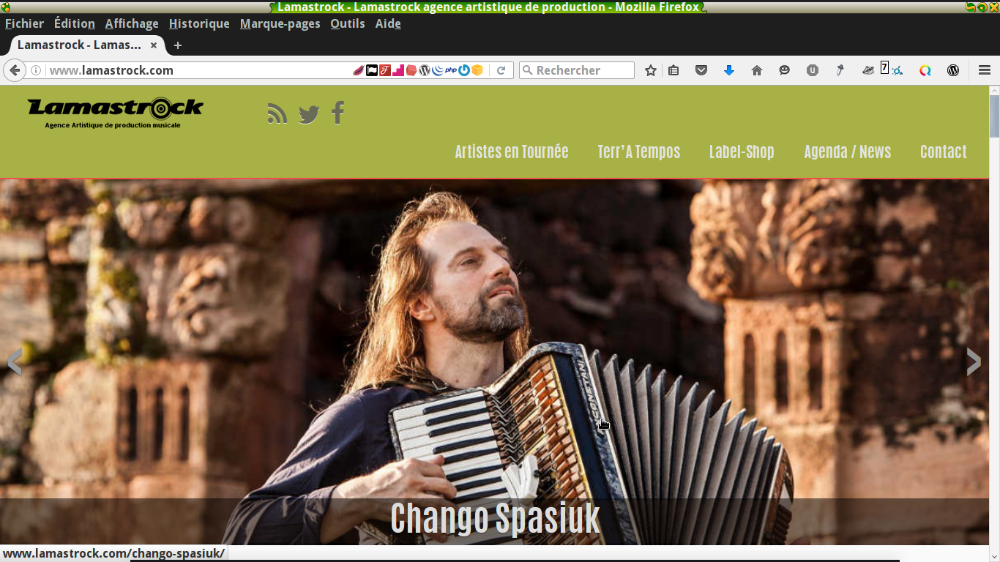
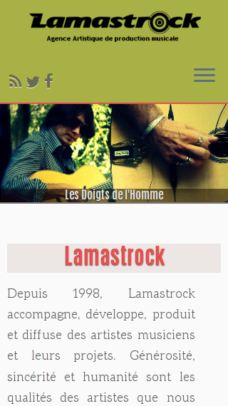
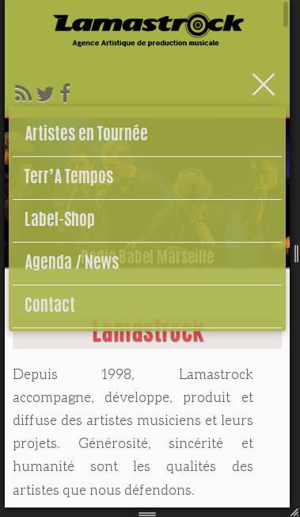
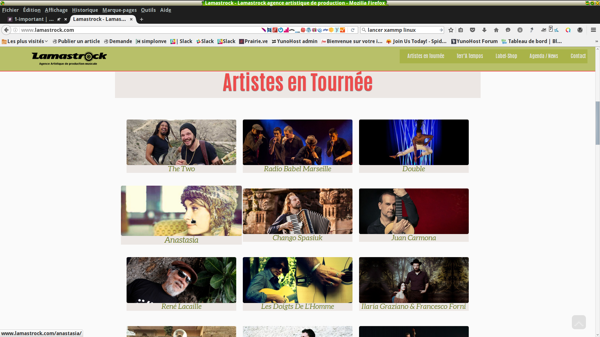
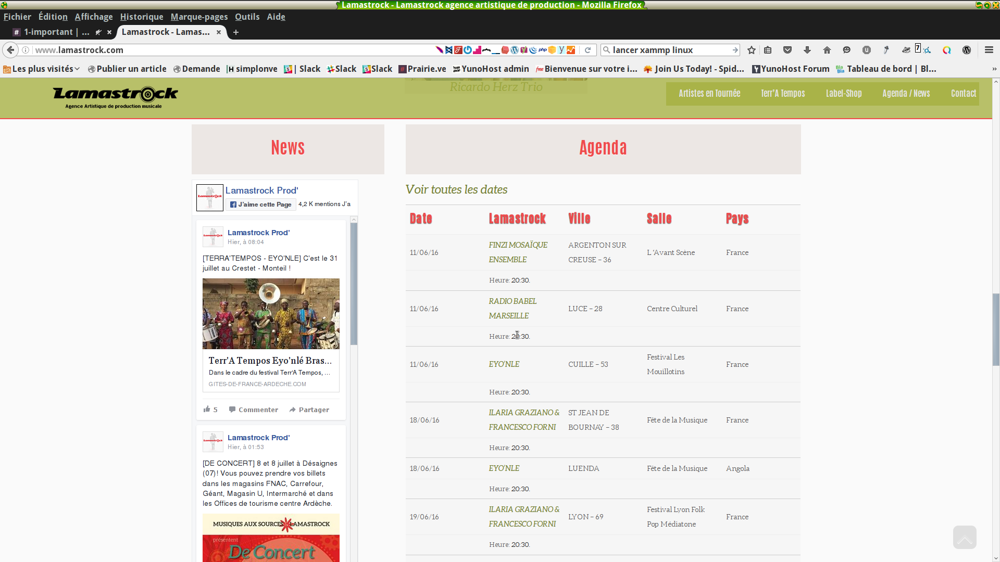

# C – Mise en production du site de Lamastrock
===
## 6 – Développer des pages web en lien avec une base de données
///
J'’ai préparé l'hébergement mutualisé d'OVH de Lamastrock pour accueillir le nouveau site en lui allouant une nouvelle base de données plus conséquente afin de continuer à héberger des anciennes versions du site et un autre site. Le site a été temporairement mis en mode de maintenance pour effectuer la migration.

===
## 7 – Mettre en œuvre une solution de contenu
///
J’ai mis en place un multi-site en Wordpress pour y héberger aussi l'ancien site et un autre site des Doigts de l'Homme géré également par Lamastrock.

Nous avons déplacer l’ancien site v3 dans un sous-répertoire de l’hébergement principal, ensuite nous créé un sous-domaine pointant vers ce répertoire. Puis modifié les urls absolues contenues dans la base de données. (exportation de la base de données avec mysql, réédition manuelle des urls et réimportation de la base de données, il nous fallu changer 129 urls …).
///
Dans l'interface d'OVH on a créé un DNS joker (wildcard), c’est à dire que lors de la création on rajoute un sous-domaine avec un *   au domaine principal. Cela implique que tous les sous-domaines créés par la suite pointeront vers le dossier /www du sous-domaine principal ou se trouve le Wordpress multisite d’où il sera possible de gérer plusieurs sites.
///
Dans l’onglet outils -> création du réseau de l’interface de Wordpress ensuite on affine les urls, le mappage des autres dossiers qui pointeront vers les autres sites.…
Pour cela on édite le fichier config.php avec ces lignes
```
/* Multisite */
define('MULTISITE', true);
define('SUBDOMAIN_INSTALL', true);
define('DOMAIN_CURRENT_SITE', 'www.lamastrock.com');
define('PATH_CURRENT_SITE', '/');
define('SITE_ID_CURRENT_SITE', 1);
define('BLOG_ID_CURRENT_SITE', 1);
define( 'SUNRISE', 'on' );
```
Note: wordpress/config.php
///
Après on créé un utilisateur super-admin. 

J'ai utilisé l'extension MU Domain Mapping pour les redirections des différents sites.
///
Il a fallu aussi rajouter ces lignes au fichier .htacess pour bien rediriger vers www_nom_de_domaine si on ne tape que le nom_de_domaine, et pour les galeries médias du site.
```
# BEGIN WordPress
RewriteEngine On
RewriteCond %{HTTP_HOST} ^lamastrock.com$
RewriteRule ^(.*) http://www.lamastrock.com/$1 [QSA,L,R=301]
RewriteBase /
RewriteRule ^index\.php$ - [L]

# add a trailing slash to /wp-admin
RewriteRule ^wp-admin$ wp-admin/ [R=301,L]

RewriteCond %{REQUEST_FILENAME} -f [OR]
RewriteCond %{REQUEST_FILENAME} -d
RewriteRule ^ - [L]
RewriteRule ^(wp-(content|admin|includes).*) $1 [L]
RewriteRule ^(.*\.php)$ $1 [L]
RewriteRule . index.php [L]
# END WordPress
```
Note: wordpress/.htaccess
///
J'ai utilisé l'outil export de Wordpress pour récupérer les données du site en développement et importer toutes les données (dont celles de l'ancien site qui étaient importées dans ce travail). 

J’ai prévu de bien garder les mêmes urls (les permaliens) pour ne pas perdre le référencement du site.

===
## 8 – développer  une application de mobilité numérique
///
Pour être bien compatible avec tous les écrans, j'ai du beaucoup personnaliser les fichiers .css avec un peu de @medias querries.

```
/* Media Querries */
/*Stop the slider growing crazily*/
@media (min-width: 1400px) {
/*Stop the slider growing crazily*/
    .carousel > .center-slides-enabled > .item > .carousel-image img {
        max-width: 1200px;
        margin-left:auto;
        margin-right:auto;
        margin-top: 8%; 
        }
     .carousel-caption {
        position: absolute;
        width: 1190px;                           
        }
}
@media (min-width: 1200px) {
     .tc-rectangular-thumb img {
         height: 500px !important;
         width: 1200px !important;
         }
}
@media all and (max-width: 480px) {
   h1 {
     font-size: 1.2em;
   }
   p {
      font-size: 0.7em;
     }
   .post-column {
       display: inline;
       float: left;
       margin-right: 18px;
       width: 100%;
    }
   ol, ul {
      margin: 0;
   }
   .su-post, .su-custom-gallery .su-custom-gallery-slide {
     margin: 0;
    }   
  }
```
Note: worpress/wp-contents/themes/lamastrockv4/stylesheet.css
///



///



///



///



///


///



///


