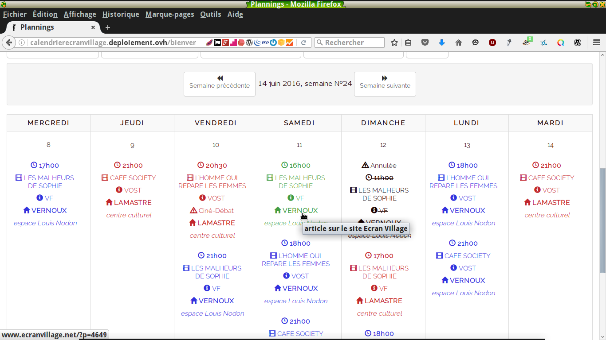

# D – Déploiement de l'application Plannings

===
## 6 – développer les pages web en lien avec une base de données
///
J'utilise Postgresql pour la base de données. Par défaut Rails utilise 3 environnements, 'development', 'production' et 'test', donc j'ai mis en place 3 database pour chaque environnements avec un utilisateur plannings_ecranvillage.

```
development:
  adapter: postgresql
  encoding: unicode
  pool: 5
  timeout: 5000
  username: plannings_ecranvillage
  password: ecran2015
  database: plannings_ecranvillage_development 
  host: 127.0.0.1

test:
  adapter: postgresql
  encoding: unicode
  pool: 5
  timeout: 5000
  username: plannings_ecranvillage
  password: ecran2015  
  database: plannings_ecranvillage_test
  host: 127.0.0.1 

production:
  adapter: postgresql
  encoding: unicode
  pool: 5
timeout: 5000
  username: plannings_ecranvillage
  password: ecran2015
  database: plannings_ecranvillage_production
  host: 127.0.0.1
```
Note: Plannings/config/database.yml
///
J'ai ajouté une gem 'httparty' qui me permet de récupérer un flux .json. 

En concertation avec Rolf Allard qui gère le site d’Écran Village, j'ai mis en place un bouton pour récupérer les nouveaux films édités sur le site. 

De son côté Rolf Allard a créé une extension Wordpress pour générer un flux .json des articles des films qui appartiennent à une catégorie 'export'.  
En cliquant sur mon bouton, si un film n'existe pas encore dans l'application, il est importé avec son id son titre et sa description.
///
```
class FilmsController < ApplicationController
[...]
# GET /ecranvillage.json       
  def ecranvillage    
       @films = Film.all             
       response = HTTParty.get('http://www.ecranvillage.net/wp-json/ecranvillage-api/v2/export')
       puts response.body, response.code, response.message, response.headers.inspect    
       JSON.parse(response.body).each do |item|    
       nouveaux_films = Film.new( :id => item["id"], :titrefilm => item["titrefilm"], :description => item["description"] )
       nouveaux_films.save       
    end    
  end
[...]
end
```
Note: Plannings/controllers/films_controllers.rb
///
Ensuite après avoir édité les séances sur l'application, grâce à l'extension api-ecranvillage, sur le site d'Ecran Village, il suffit de mettre le shortcode [seances] en rajoutant un champ personnalisé avec film_id = XXX ou XXX égal à l'id du film sur l'application qui est aussi l'id de la page Wordpress du film, pour avoir les séances sur le site.

Le shortcode regarde la page films.json de l'application pour voir les films, puis la page show/xx.json d'un film ou xx est son id pour connaître les séances d'un film, puis la page villages.json pour connaître les lieux des séances.
///
```
date_range  = 2.month.ago..Date.today + 1
json.array!(@films.where(updated_at: date_range).order(created_at: :desc)) do |film|
  json.extract! film, :id, :titrefilm, :description 
  json.url film_url(film, format: :json) 
end
```
Note: Plannings/app/fims/index.json.builder
///
```
date_range  = 1.month.ago..Date.today + 30
json.array!(@film.seances.where(horaire: date_range).order(horaire: :asc)) do |seance|
  json.extract! seance, :id, :film_id, :version, :horaire, :village_id, :statut  
end
```
Note: Plannings/app/films/show.json.builder
///
```
json.array!(@villages) do |village|
  json.extract! village, :id, :salle, :espace
  json.url village_url(village, format: :json)
end
```
Note: Plannings/app/villages/show.json.builder 

===
## 7 – Mettre en œuvre une solution de gestion de contenu
///
J'ai déployée l'application sur Heroku en premier lieu, elle a été en service assez rapidement pour avoir des retours des utilisateurs qui m'ont permis de la faire évoluer. Je l'ai mise en production sur ce serveur.

Maintenant elle est devenue une version de <a href="https://planning-ecranvillage.herokuapp.com" target="_blank">Démo</a> sur ce serveur.

J'ai pris ensuite l'initiative de la déployée sur un serveur privé VPS d'OVH avec un OS Debian.
/// 
J'ai du configurer le serveur avec rvm, git pour cloner l'application et pouvoir mettre à jour les commits. Nginx pour le serveur, Passenger pour la mettre en production, Postgresql pour la base de données. 

Je me connecte en ssh sur le serveur. J'ai mis en place des mesures de sécurité en fermant certains ports, l'utilisateur root ne peut pas se connecter en ssh, c'est un utilisateur avec des droits sudo et le port ssh n'est pas celui par défaut. 
///
J'ai traduit aussi les pages d'erreurs et tout ce que je pouvais. J'ai du aider les utilisateurs qui ne sont pas habitués au numérique à s'inscrire et à utiliser l'application. 

===
## 8 – développer  une application de mobilité numérique
///
L'application est responsive design, en partie grâce à Bootstrap. 

J'ai du quand même conséquemment éditer les fichier .css
///
J'ai ajouté un link-to-the-top avec un peu de js et de css pour remonter en haut de page.
///
```
var amountScrolled = 300;

$(window).scroll(function() {
  if ( $(window).scrollTop() > amountScrolled ) {
    $('a.back-to-top').fadeIn('slow');
  } else {
    $('a.back-to-top').fadeOut('slow');
  }
});
$('a.back-to-top').click(function() {
  $('html, body').animate({
    scrollTop: 0
  }, 700);
  return false;
});
```
Note: Plannings/app/assets/javascripts/scroll.js
///
```
[...]
a.back-to-top {
  display: none;
  width: 60px;
  height: 60px;
  text-indent: -9999px;
  position: fixed;
  z-index: 999;
  right: 20px;
  bottom: 20px;
  background: #27AE61 url(<%= asset_data_uri 'up-arrow.png' %>) no-repeat center 43%;
  -webkit-border-radius: 30px;
  -moz-border-radius: 30px;
  border-radius: 30px;
}
[...]
```
Note: Plannings/app/assets/stylshheets/application.scss.erb

///


///



///


///


///


///


///


///


///


///


///


///


///


///


///


///


///


///


///


///


///


///


///


///


///


===
## 9 – Utiliser l'anglais dans son activité professionnelle en informatique.
///
J'ai documenté mon application sur un wiki sur le dépôt Gitlab de framasoft ou est déposée l'application. 
J'ai traduit une bonne partie des pages.

Sinon je communique assez souvent sur des forums techniques en anglais, sur Stackoverflow, sur les forums de Wordpress et sur divers forums liés à Gnu/Linux ou à l'informatique.
///
Extraits du wiki version anglaise :
### What for ?
* This application has been developed for an mobile cinema to organise the voluntary workers plannings for the showings and the cashier in each shows. Since we've got numeric projectors, the activity have consequently increased and we needed a tool to make the planning task easier.
///
* Actually, the application is in production <a href="https://planning-ecranvillage.herokuapp.com/" target="_blank">here</a> on a Heroku's server because it's a simple way to deploy a Ruby on Rails application. As it's also deployed on another server for the management of our Plannings, this adress in Heroku is now a demo application. Feel free to try it.
///
*  You can login here <a href="https://planning-ecranvillage.herokuapp.com/log_in" target="_blank">connection</a> and to get connected, put this email : manager@demo.com and this password : manager to be connected as a 'manager' like the voluntary workers or with this email : admin@demo.com and this password : admin to be connected as an administrator. Be respectful, I open this application by my own risk to let interested people discover how it works. 
///

### About
* After a web developer's formation with <a href="http://www.simplonve.co/" target="_blank">Simplonve</a>, I started to develop this application on Ruby on Rails. I've been inspired by a <a href="https://richonrails.com/articles/building-a-basic-calendar-in-ruby-on-rails" target="_blank">basic Calendar</a> on Ghitub to begin with. and evolved the application from there.
* My first idea was the fact we needed a view foe each place as the voluntary workers are distant one from another and interested only on the nearby shows. So we do not need one calendar, but rather a few calendars.
* The application use Bootstrap and is responsive design.
* I have added a login interface, permissions and an administration interface.
///
* The application is linked with the site of the association on Wordpress. We built an extension for it which permit to import the data of the new picture's titles and descriptions on the application with one click. You can found the source of this extension on Ghitub <a href="https://github.com/RavanH/ecranvillage-api" target="_blank">ecranvillage-api</a>. 
///
* Then, when the shows are edited on the application, from the site on Wordpress, you just have to put a shortcode [seances film_id ="XX"] where the value XX is the id of the picture in the application, also the id of the page edited in the site. This will automated the view of the shows related edited on the application on the page using a RESTfull API to post from a .json file the informations.This is very useful to edit only once the titles and the shows syncing them and avoid making errors between the twoo sources of information.
///
* I will detail the building of this application on this wiki, so you will know everything about it, how it works, the qualities and defects. Feel free after to adapt this project if you need it, you can fork it.
///

### Installation Ruby on Rails with rvm and dependencies :
* Ruby version : ruby 2.2.1
* You need to install ruby and ruby on rails or rvm is a better solution. To get rvm add some dependencies (on a GNU/linux OS)

```
$ sudo apt-get install git-core curl zlib1g-dev build-essential libssl-dev libreadline-dev libyaml-dev libsqlite3-dev sqlite3 libxml2-dev libxslt1-dev libcurl4-openssl-dev python-software-properties libffi-dev
```


///
Have a look on this link to do it (don't forget to have a look if you already have an ruby version installed on your system, in that case you will need to remove it before !) : see <a href="https://rvm.io/rvm/install" target="_blank">rvm</a>.

* Install the key needed for rvm : 

```
$ gpg --keyserver hkp://keys.gnupg.net --recv-keys 409B6B1796C275462A1703113804BB82D39DC0E3
```

* Download RVM and install Ruby:

``` 
$ \curl -sSL https://get.rvm.io | bash -s stable --ruby
```

* Then you do this to actualize the shell :

``` 
$ source ~/.rvm/scripts/rvm
```

**You need to quit the shell and restart it**

///

* Verify if Ruby is founded by the console :

```
$ type rvm
```

* To get ruby 2.2.1 :

``` 
$ rvm install 2.2.1
```

* Then to get rails only add this on your bash (this will install a newest stable version of rails, for this project you need another version, see later) : 

```
$ gem install rails
```

and 

```
$ sudo apt-get install libpq-dev
```

///

* To use ruby 2.2.1, don't forget doing this in your project : 

```
$ cd plannings_ecranvillage
$ rvm use 2.2.1
$ gem install rails
```
///

### Install Node.js

* You need also node.js with recent version of Rails, so do this :

```
$ sudo apt-get install nodejs
```

///

### Installation:

* To configure the application, you can clone it, run 

```
$ git clone https://github.com/rodinux/plannings_ecranvillage.git
```
or fork it , as you want. 

* Go on your application folder and install gems :

``` 
$ cd plannings_ecranvillage
$ bundle install
```

///

### Deployment instructions
It is possible you want to change the database, (I personnally use postgresql), if you want to use it without postgesql and without creating first a database, it is very easy. You need to make few changes, in the file config/database.yml, replace all by : 

///

```
# SQLite version 3.x
#   gem install sqlite3-ruby (not necessary on OS X Leopard)
development:
  adapter: sqlite3
  database: db/development.sqlite3
  pool: 5
  timeout: 5000

# Warning: The database defined as "test" will be erased and
# re-generated from your development database when you run "rake".
# Do not set this db to the same as development or production.
test:
  adapter: sqlite3
  database: db/test.sqlite3
  pool: 5
  timeout: 5000

production:
  adapter: sqlite3
  database: db/production.sqlite3
  pool: 5
  timeout: 5000

```
Note: app/config/database.yml

///

* You always need to migrate the database before running

```
$ rake db:migrate
```

* To sart the application locally

```
$ rails s
```

* If you got it without issues you would try the application on this link
 
[http://localhost:3000](http://localhost:3000) 

