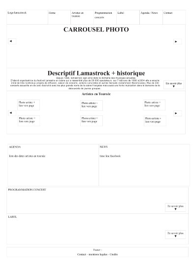
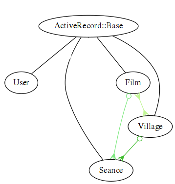
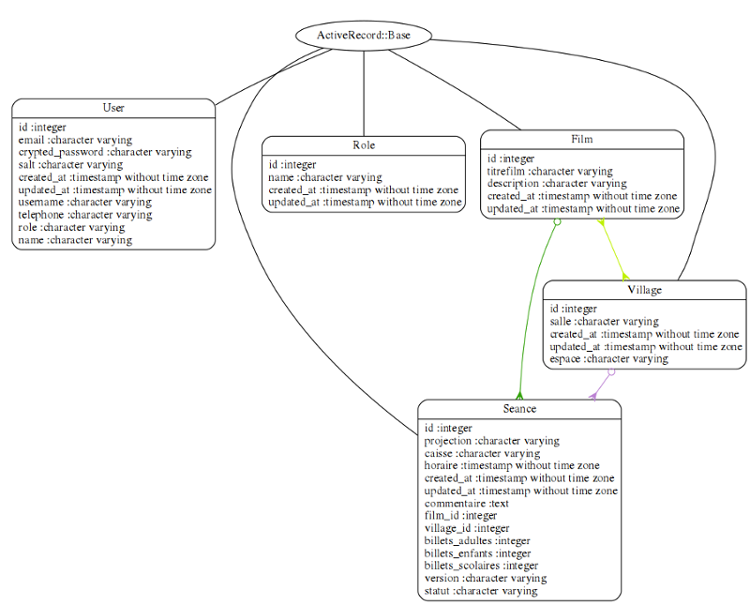
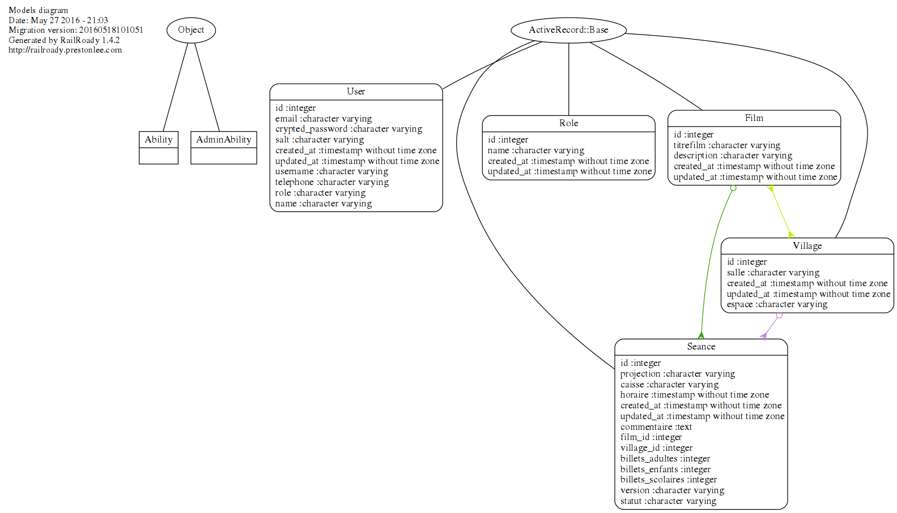
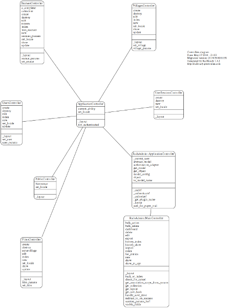

# Activité-type 1
## Développer une application client-serveur

///

 * A - Refonte du site de Lamastrock

 * B – Développement de l'application Plannings
===

# A - Refonte du site de Lamastrock

===
##1 - Maquéter une application
///
Le site de Lamastrock en Wordpress n'était pas responsive design et ne pouvait pas être upgrader sans casser des dépendances, il fallait le reconstruire.

Nous avons proposé des maquettes avec Balsamiq puis sur des feuilles A5 avec comme ligne directrice de réunir différentes pages sur la page d'accueil pour éviter d'avoir à naviguer dans plusieurs pages.
///

Note: Je n'ai pas garder de version des wireframe avec Balsamiq, après version d'essai, j'ai supprimé ce logiciel privateur.
///
Nous nous sommes mis d'accord sur deux mises en page pour l 'accueil et pour les artistes. Nous avons choisi de garder la charte graphique d'une designer qui avait établi une maquette pour un événement culturel organisé par Lamastrock , TerraTempo, en reprennant entre autres les codes des couleurs et des polices.
///

///
J'ai mis en place sur le lieu de formation une machine serveur avec une distribution **Mageia**, la configuration de **Apache** + **Lamp** + **Mysql** pour y installer un framework **Wordpress** en local qui est devenue notre outil de travail et d'élaboration en intranet.
///
Configuration pour Apache pour utiliser un dossier public_html en local


```
<IfModule mod_userdir.c>
        UserDir public_html
        UserDir disabled root
        <Directory /home/*/public_html>
                AllowOverride FileInfo AuthConfig Limit Indexes
                Options MultiViews Indexes SymLinksIfOwnerMatch IncludesNoExec
                <Limit GET POST OPTIONS>
                        Require all granted
                </Limit>
                <LimitExcept GET POST OPTIONS>
                        Require all denied
                </LimitExcept>
        </Directory>
</IfModule>
```

Note: /etc/apache2/mods-enabled/userdir.conf
///
Pour utiliser php5 en local

```
<IfModule mod_php5.c>
    <FilesMatch "\.ph(p3?|tml)$">
        SetHandler application/x-httpd-php
        Require all granted
    </FilesMatch>
    <FilesMatch "\.phps$">
        SetHandler application/x-httpd-php-source
        Require all denied
    </FilesMatch>
    # To re-enable php in user directories comment the following lines
    # (from <IfModule ...> to </IfModule>.) Do NOT set it to On as it
    # prevents .htaccess files from disabling it.
    #<IfModule mod_userdir.c>
    #    <Directory /home/*/public_html>
    #        php_admin_value engine Off
    #    </Directory>
    #</IfModule>
</IfModule>
```
Note: etc/apache2/mods-available/php5.conf 

===
## 2 – Concevoir une base de données
///
J'ai  ensuite déposé une version récente de Wordpress. Créé une base de données et un utilisateur pour cette base de données avec phpMyadmin.
```
mysql> CREATE DATABASE lamastrosql CHARACTER SET utf8 COLLATE utf8_unicode_ci;
```
```
mysql> CREATE USER 'lamastrock'@'localhost' IDENTIFIED BY 'monsupermotdepasse';
GRANT SELECT,INSERT,UPDATE,DELETE, CREATE ON *.* TO 'lamastrosql'@'localhost';
```

///

Une fois le dossier Wordpress déposé sur le serveur dans le dossier public_html, on édite le fichier wp-config-php avec les identifiants et le nom de la base de données à utiliser.

```
// ** Réglages MySQL - Votre hébergeur doit vous fournir ces informations. ** //
/** Nom de la base de données de WordPress. */
define('DB_NAME', 'lamastrosql');

/** Utilisateur de la base de données MySQL. */
define('DB_USER', 'lamastrock');

/** Mot de passe de la base de données MySQL. */
define('DB_PASSWORD', 'lamastrockv4');

/** Adresse de l'hébergement MySQL. */
define('DB_HOST', 'localhost');

/** Jeu de caractères à utiliser par la base de données lors de la création des tables. */
define('DB_CHARSET', 'utf8');

/** Type de collation de la base de données.
  * N'y touchez que si vous savez ce que vous faites.
  */
define('DB_COLLATE', '');
```

Note: public_html/wordpress/wp-config-php

///
Pour pouvoir installer des extensions et des thèmes sans passer par ftp sur le serveur local.

```
$ sudo chown -R nom_utilisateur_apache: wordpress
```

Note: suivant la configuration le nom de l'utilisateur de apache peut être différent (www-data apache ou daemon).

===
## 3 – Mettre en place une base de données
///
J'ai importé les tables de la base de données de l'ancien site que m'a envoyé le webmaster avec phpMyadmin.
``` 
mysql -u root -p -h localhost lamastrosql < /home/lamastrock/lamastro.sql
```
///
J'ai choisi de créer un thème enfant Lamastrockv4 pour personnaliser le site.

```
/*
 Theme Name:     Customizr Child
 Theme URI:      http://lamastrockv4.deploiement.ovh/
 Description:    Theme enfant pour lamastrock
 Author:         Rodolphe Robles
 Author URI:     https://www.rodinux.fr/
 Template:       customizr
 Version:        1.0.0
*/
```
Note: public_html/wordpress/wp-content/themes/lamastrokv4/stylesheet.css
///
J'ai développé le css et mis en place les extensions qui allait être utiles, customisé le thème de Gigpress avec un nouveau fichier gigpress.css et changer quelques attributs du thème parent pour avoir la taille voulue des images dans le Slider de la page principale.
```
add_filter( 'tc_thumb_size', 'my_thumb_size');
function my_thumb_size() {
     $sizeinfo = array( 'width' => 1200 , 'height' => 500, 'crop' => false );
     return $sizeinfo;
}
```
Note: public_html/wordpress/wp-content/themes/lamastrokv4/functions.php
///
J'ai mis en place une fonction loop (une boucle) en php avec un shortcode, en utilisant l'extension Shortcode Ultimate, pour automatiquement prendre les images mises à la une d'un article des catégories «artistes» dans une étiquette sur la page principale d'Accueil.
```
[su_posts template="templates/teaser-loop.php" posts_per_page="18" width="300" height="120" tax_term="5" tax_operator="0" order="desc" orderby="date"]
```
///
J'ai ensuite mis en place le travail effectué sur un serveur mutualisé d'OVH afin de travailler à distance de manière agile avec le client.

===
### 4 – Développer une interface Utilisateur 
### 5 – Développer des composants d'accès aux données
///
Pour cet exemple, je n'ai pas eu grand-chose à faire, puisque le framework Wordpress inclut le nécessaire pour administrer le site. 
La seule particularité est dans le fait qu'il soit devenu un multi-site ce qui implique que je suis le seul à avoir accès aux permissions de super-administrateur pour  rajouter des extensions ou des thèmes, les activer ou non sur le site, faire des mises à jour ou bien rajouter un site. 
Ceci permet une sécurité supplémentaire et demande aussi une maintenance et une vigilance assez régulière. 

===
# B – Développement de l'application Plannings
===
## 1- Maquetter une application
J'ai décidé dès le départ que je voulais arriver à plusieurs vues de calendriers par lieux, pour faciliter l'édition des bénévoles. J'ai créer une application avec Ruby on Rails en utilisant rvm qui permet d'avoir plusieurs versions de Rails sur sa machine
///
```
$ rails new plannings_ecranvillage
$ rake db:migrate
```
///
Mon idée avant tout était de me mettre à la place du bénévole qui s'inscrit pour être projectionniste ou pour faire la caisse pour une séance. Comme l'association Écran Village diffuse des films dans divers lieux régulièrement, plus de l'itinérance dans d'autre lieux, ma préoccupation était de facilement choisir sa disponibilité en fonction du lieu, puisque c'est la première chose que regarde un bénévole, les séances ayant cours dans son lieu proche.
///
J'ai pensé que j'avais besoin de quatre tables principales, la table User des utilisateurs, la table Seance des séances, la table Film pour les films et la table Village pour les lieux.
```
$ rails g scaffold User name:string                       
$ rails g scaffold Film titrefilm:string descripton:string
$ rails g scaffold Village salle:string espace:string
$ rails g scaffold Seance horaire:date lieu:string projection:string caisse:string
```
Note: Ceci était les débuts de la réalisation de l'application, ensuite l'authentification et les autorisations vont me demander de procéder légèrement autrement.
///
Je me suis inspiré au départ d'un exemple sur Github de calendrier très basique from scratch [Basic Calendar](https://richonrails.com/articles/building-a-basic-calendar-in-ruby-on-rails) .

J'ai mis en place le fichier calendar.rb pour la structure du calendrier après avoir mis en place les bibliothèques de Bootstrap. Avec un helper pour appeler cette structure et une méthode pour appeler le paramètre 'date' dans le contrôleur que j'ai fini par mettre dans l'objet Seance par la suite. 

Note: La semaine de cinéma démarre le Mercredi. Au début de la réalisation, j'avais séparé ce calendrier de l'objet séances et je n'est pas tout de suite trouvé comment séparer les calendriers par lieux, j'avais donc édité plusieurs calendriers. Pour inclure les séances dans le calendrier, je n'avais pas trouvé la meilleure méthode, je montrerai ici la version plus aboutie.
///
```
class Calendar < Struct.new(:view, :date, :callback)

    def table(lieu)
        content_tag :table, class: "calendar table table-bordered table-striped" do 
            header + week_rows           
        end
    end

    HEADER = %w[Mercredi Jeudi Vendredi Samedi Dimanche Lundi Mardi]
    START_DAY = :wednesday

    def header
        content_tag :tr do
            HEADER.map { |day| content_tag :th, day }.join.html_safe
        end
    end
    
    def weeks
        first = date.beginning_of_week(START_DAY)
        last = date.end_of_week(START_DAY)
        (first..last).to_a.in_groups_of(7)
    end

    delegate :content_tag, to: :view

    def week_rows       
      weeks.map do |week|
          content_tag :tr do
          week.map { |day| day_cell(day) }.join.html_safe
        end
      end.join.html_safe
    end
    
    def day_cell(day)
        content_tag :td, view.capture(day, &callback), class: day_classes(day)              
    end

    def day_classes(day)
        classes = []
        classes << "today" if day == Date.today
        classes << "nodate" if day.month != date.month
        classes.empty? ? nil : classes.join(" ")
    end
end
```
Note: Plannings/lib/calendar.rb
///
```
module SeancesHelper
    def seances (date = Date.today, &block)
      Calendar.new(self, date, block).table(params[:lieu])
    end
end
```
Note: Plannings/app/helpers/seances_helper
///
```
class SeancesController < ApplicationController

 def calendrier    
    @seances = Seance.all
    @seances_horaire = @seances.group_by(&:horaire)
    lieu = params[:lieu]
    @date = params[:date] ? Date.parse(params[:date]) : Date.today    
 end
```
Note: Plannings/app/controllers/seances_controller 
///
```
<div class="container">  
  <div class="row">
    <div class="col-md-12 text-center">
      <div class="well controls">
        <%= link_to calendrier_path(date: @date - 1.week), class: "btn btn-default" do %>
          <div class="glyphicon glyphicon-backward"><p>Semaine précédente</p></div>
        <% end %>
        <%= "#{l @date, format: :middle}, #{@date.strftime("semaine N°%W")}" %>
        <%= link_to calendrier_path(date: @date + 1.week), class: "btn btn-default" do %>
          <div class="glyphicon glyphicon-forward"><p>Semaine suivante</p></div>
        <% end %>
      </div>
    </div>
  </div>
  <div class="row">
    <div class="col-md-12">
        <%= seances @date do |date| %>       
          <p><%= date.day %></p>
        <% end %>
     </div>
   </div>
</div>
```
Note: Plannings/app/views/seances/calendrier.html.erb

===
## 2 – Concevoir une base de données
///
J'ai mis en place des associations de table pour l'objet Seance, lié à la table Film (pour le titre du film) avec une colonne film_id qui aura la valeur de l'id du film lié et à la table Village (pour le lieu) avec une colonne village_id qui aura la valeur de l'id du village. 
Les tables Film et Village sont liés à travers l'objet Seance, puisque une séance a obligatoirement un lieu et un film (c'est une des contraintes de l'objet Seance).
///

///
```
class Seance < ActiveRecord::Base
  
    belongs_to :film, :inverse_of => :seances
    belongs_to :village, :inverse_of => :seances    
    validates :film_id, :presence => true
    validates :village_id, :presence => true
    validates :horaire, :presence => true
end
```
Note: Plannings/app/models/seance.rb
///
```
class Film < ActiveRecord::Base
 
    has_many :seances, :dependent => :destroy, :inverse_of => :film
    accepts_nested_attributes_for :seances, :allow_destroy => true
    has_many :villages, :through => :seances    
    validates :id, :uniqueness => true
    validates :titrefilm,:uniqueness => true
end
```
Note: Plannings/app/models/film.rb
///
```
class Village < ActiveRecord::Base
    has_many :seances, :inverse_of => :village
    has_many :films, :through => :seances 
    validates :id, :uniqueness => true
    validates :salle, :presence => true 
end
```
Note: Plannings/app/models/village.rb  
///
Dans ces modèles ci-dessus, on a vu les associations et les contraintes SQL. 
Si on détruit un film, les séances liées à ce film aussi sont détruites. 
Les validates ajoutent des contraintes SQL et donc permet d'accélérer les requêtes. L'unicité de l'id et de titrefilm dans l'objet Film est indispensable par la suite pour une méthode d'import des films édités sur le site d’Écran Village.
Ceci permet grâce aux associations de table et aux méthodes de Rails d'utiliser des méthodes comme :
``` 
<%= @seance.village.salle %> = le lieu de la seance
<%= @village.seances.where(statut: "seances scolaires").count %> le nombre de séances scolaire pour le village
<%= @seance.film.titrefilm %> = le titre du film de la séance 
<%= @film.seances.count %> = le nombre de séances pour le film
<%= @film.villages.salle %> = les salles où il y a des séances pour un film
```

===
## 3 – Mettre en place une base de données
///
Pour l'authentification, j'ai utilisé une gem (librairie) Sorcery. Pour sa mise en place, il fallait supprimer avant la table User, puisque Sorcery a besoin de l'installer.
Ensuite on créer d'abord l'objet User, mais sans migration de table dans la base de données avec cette commande
``` 
$ rails g scaffold user email:string crypted_password:string salt:string --migration false
```
///
Après avoir ajouté dans le fichier Gemfile gem 'Sorcery', quand on ajoute une librairie on lance toujours un 
```
$ bundle install
```
puis pour mettre en place Sorcery on lance 
```
$ rails g sorcery:install
```
Maintenant on peut migrer les tables SQL
```
$ rake db:migrate
```
///
```
class SorceryCore < ActiveRecord::Migration
  def change
    create_table :users do |t|
      t.string :email,            :null => false
      t.string :crypted_password
      t.string :salt

      t.timestamps
    end

    add_index :users, :email, unique: true
  end
en

```
Note: Plannings/congig/db/migrate/20160121143435_sorcery_core.rb
///
Ensuite, il fallait changer le formulaire de création des utilisateurs pour remplacer les champs  'crypted_password' et 'salt' par 'password' et 'password_confirmation'
```
<%= form_for(@user) do |f| %>
  <% if @user.errors.any? %>
    <div id="error_explanation">
      <h2><%= pluralize(@user.errors.count, "error") %> prohibited this user from being saved:</h2>
      <ul>
      <% @user.errors.full_messages.each do |message| %>
        <li><%= message %></li>
      <% end %>
      </ul>
    </div>
  <% end %>
<div class="field">
      <%= f.label :password, :value => 'Mot de passe (minimum 5 caractères, à bien retenir, vous servira pour se connecter)' %><br />
      <%= f.password_field :password, :maxlength => 30, autofocus: true %>
   </div>
   <div class="field">
      <%= f.label :password_confirmation, :value => 'confirmation du mot de passe' %><br />
      <%= f.password_field :password_confirmation, autofocus: true %>
   </div>
  <div class="actions">   
    <input type="submit" class="btn btn-lg btn-warning" value="Valider" />
  </div>  
<% end %>
```
Note: Plannings/app/views/users/_form.html.erb
///
Ensuite on rajoute dans le modèle User la méthode qui appelle l'authentification.
```
[...]
   authenticates_with_sorcery!
[...]

```
Note: Plannings/app/models/user.rb
///
Sorcery utilise bcrypt-ruby pour crypter le mot de passe et salt va rajouter un random hash pour rendre plus difficile la possibilité à un attaquant de déchiffrer la cryptographie.  

On doit modifier le contrôleur pour les utilisateurs
```
class UsersController < ApplicationController
  def new
    @user = User.new
  end

  def create
    @user = User.new(user_params)
    if @user.save
      login(params[:user][:email], params[:user][:password])
      flash[:success] = 'Welcome!'
      redirect_to root_path
    else
      render 'new'
    end
  end

  private

  def user_params
    params.require(:user).permit(:email, :password, :password_confirmation, :name)
  end
end

```
Note: Plannings/app/controllers/users_controllers
///
Il faut rajouter les routes pour se connecter.
```
get 'login' => 'user_sessions#new', :as => :login
```
Note: Plannings/config/routes.rb
///
Avec Sorcery on ajoute au contrôleur de l'application dans models/application.rb 
```
before_action :require_login
```

Ensuite pour les fichiers où on ne veut pas forcer l'authentification, on peut ajouter des méthodes dans les controlleurs pour avoir des exceptions.  
```
skip_before_action :require_login, except: [:destroy]
```

```               
skip_before_action :require_login, only: [:index, :ecranvillage, :show ]
```
///
Une ligne à ajouter avec la version récente de sorcery dans l'initializer :
```
Rails.application.config.sorcery.configure do |config|
   config.user_config do |user|
 end
  # This line must come after the 'user config' block.
  # Define which model authenticates with sorcery.
  config.user_class = "User"
end
```
Note: Plannings/config/initializers/sorcery.rb
///
L'étape suivante est de créer un autre contrôleur pour implémenter la fonctionnalité de se connecter et se déconnecter dans une session.
```
$ rails g user_session --skip model name:string password:string new destroy
```
///
```
class UserSessionsController < ApplicationController
 
   before_action :set_locale
  def set_locale
    I18n.locale = :fr 
  end   
  
   skip_before_action :require_login, except: [:destroy]

    def new
        @user = User.new
    end

  def create
      if @user = login(params[:email], params[:password])
        redirect_back_or_to(root_path, notice: 'Connexion réussie !')
      else          
        render action: 'new', notice: 'Oups! Une erreur ?...recommencez.'
      end
    end

  def destroy
    logout
    redirect_back_or_to(root_path, notice: 'Déconnecté !')
  end  
end
```
Note: Plannings/app/controllers/users_sessions
///
Pour les utilisateurs on rajoute au controlleur
```
users_controller.rb
[...]
skip_before_action :require_login, only: [:new, :create]
[...]
```
Note: Plannings/app/controllers/user_controller
///
Puis on ajoute la route pour se déconnecter
```
get 'log_in' => 'user_sessions#new', :as => :log_in
post 'log_out' => 'user_sessions#destroy', :as => :log_out

```
Note: Plannings/config/routes.rb
///
Il faut ajouter aussi au contrôleur de l'application la méthode qui réclame une authentification et qui redirige vers la page de connexion.
```
[...]
private

def not_authenticated
  flash[:warning] = 'You have to authenticate to access this page.'
  redirect_to log_in_path
end
[...]
```
Note: Plannings/app/controllers/application_controller.rb
///
Pour se connecter ensuite j'ai créer la vue du formulaire de connexion. 
```
<p id="notice"><%= flash[:notice] %></p>
<%= form_tag user_sessions_path, :method => :post do %>  
  <div class="field">
    <%= label_tag :email, 'Votre email' %><br />
    <%= text_field_tag :email, nil, required: true %>
  </div>
  <div class="field">
    <%= label_tag :password, 'Votre mot de passe' %><br />
    <%= password_field_tag :password, nil, required: true %>
  </div>  
  <div class="actions">
    <%= submit_tag "Se connecter", :class => "btn btn-lg btn-warning" %>
  </div>
<% end %>
```
Note: Plannings/app/views/users_sessions/_form.html.erb
///
Et dans le block principal de l'application un bouton accordéon pour accéder à l'enregistrement ou la connexion.
```
<div class="container">
  <nav class="nav navbar-light bg-inverse navbar-nav navbar-left connexion">
        <button class="navbar-toggler connexion" type="button" data-toggle="collapse" data-target="#exCollapsingNavbar" >
      &#9776;
        </button>
    <div class="nav navbar-nav navbar-right connexion">       
      <% if current_user %>
      <br>
        <h4>Bienvenue ! <span class="label label-info"><%= current_user.username %></span></h4>            
          <%= link_to "Se déconnecter", :log_out, method: :post, :class => 'btn btn-lg btn-success' %>              
      <% else %>
        <div class="collapse" id="exCollapsingNavbar">
          <div class="bg-inverse p-a-1">
              <div class="container connexion">
              <h3><span class="glyphicon glyphicon-warning-sign"></span> Attention, réservé aux bénévoles d'Ecran Village :</h3> 
              <h4>Si vous ne l'avez pas encore fait, enregistrez-vous : <span><%= link_to "S'enregistrer", new_user_path, :class => "label label-warning" %></span></h4>
              <h4>Puis connectez-vous ! <span><%= link_to "Se connecter", log_in_path, :class => "btn btn-lg btn-success"%></span></h4>
              <p id="notice"><%= flash[:notice] %></p>
              </div>                      
          </div>
        </div>
      <% end %>             
    </div>
  </nav>
```
Note: Plannings/app/views/layouts/_connexion.html.erb
///
Pour les utilisateurs, j'ai rajouté les colonnes 'username' , 'name', 'telephone' et 'role'.
///
Pour l’autorisation, j'ai ajouté une gem CanCanCan. 
On créer le modèle des permissions avec la commande 
```
$ rails g cancan:ability
```
Cela génère le fichier ability.rb où on défini les permissions des utilisateurs
///
```
class Ability
  include CanCan::Ability
 
  def initialize(user)
    # Define abilities for the passed in user here. For example:
    
    user ||= User.new # guest user (not logged in)
  
      if user.role == "manager"
       can :read, Village
       can :update, User
       can :update, Seance
       cannot :update, Village
       cannot :destroy, User 
       cannot :destroy, Seance
       cannot :rails_admin
       cannot :import, :all

    end 
    # alias_action :update, :destroy, :create, :to => :write   
    if user.role == "admin"        
      can :manage, :all   
      # can :write, :all         
      can :update, :all
      can :destroy, :all      
      can :rails_admin
      can :dashboard 
      can :import, :all
    end 
    # https://github.com/CanCanCommunity/cancancan/wiki/Defining-Abilities
  end
end
```
Note: Plannings/app/models/ability.rb
///
Il m'a fallu aussi ajouter une table Role 
```
$ rails g model role name
```
  et ajouté une jointure de table.
```
$ rails g migration CreateJoinTableUserRole user role
```
Cela créer une association de table avec des colonnes user_id et role_id.
```
class CreateJoinTableUserRole < ActiveRecord::Migration
  def change
    create_join_table :users, :roles do |t|
      # t.index [:user_id, :role_id]
      # t.index [:role_id, :user_id]
    end
  end
```
Je n'ai pas obtenu ce que je voulais avec cette méthode.  
Note: Plannings/db/migrate/20160202141004_create_join_table_user_role.rb
///
Dans le contrôleur de l'application on ajoute ces lignes
```
rescue_from CanCan::AccessDenied do |exception|
  redirect_to main_app.root_path, :alert => exception.message  
end
```
Note: Plannings/app/controllers/application_controller
///
Ensuite, dans le modèle de User, je rajoute les valeurs de la colonne role et choisi d'enregistrer par défaut les nouveaux utilisateurs comme 'guest' (invités).
```
 authenticates_with_sorcery!
  before_create :setup_default_role_for_new_users
  
  ROLES = %w[guest manager admin]  

  validates :password, length: { minimum: 5 }, if: -> { new_record? || changes["password"] }
  validates :password, confirmation: true, if: -> { new_record? || changes["password"] }
  validates :password_confirmation, presence: true, if: -> { new_record? || changes["password"] }
  validates :username, uniqueness: true
  validates :email, uniqueness: true
     
  private
  
    def setup_default_role_for_new_users
      if self.role.blank?
        self.role = "guest"
      end
    end
end
```
Note: Plannings/app/models/user.rb
///
Ensuite dans les vues je peux choisir les permissions avec en utilisant une méthode can? ou  cannot? 
```
[...] 
          <tr>
              <td><%= user.username.capitalize %></td>
              <td><%= user.name.capitalize %></td>
            <% if can? :update, User %>
               <td><%= user.email %></td>
               <td><%= user.telephone %></td>
              <% if user.username == current_user.username %>
               <td class="warning"><span class="glyphicon glyphicon-pencil"></span> <%= link_to 'Me modifier', edit_user_path(user), data: { confirm: 'En êtes-vous sûr ?' }, :class => "btn btn-warning" %></td>
              <% else %>
               <td></td>
              <% end %>            
            <% end %>
              <% if can? :manage, User %>
               <td class="info"><%= user.role %></td>
               <td class="danger"><span class="glyphicon glyphicon-trash"></span> <%= link_to 'Supprimer', user, method: :delete, data: { confirm: 'En êtes vous sûr ?'}, :class => "btn btn-danger" %> <br>
               <span class="glyphicon glyphicon-pencil"> </span> <%= link_to 'Editer', edit_user_path(user), data: { confirm: 'En êtes-vous sûr ?' }, :class => "btn btn-warning" %></td>
              <% end %>              
          </tr>
[...]
```
Note: exemple, un tableau dans le fichier index des utilisateurs. 
///
Pour les tables, j'ai ajouté au fur et à mesure des colonnes.

///
Entre autres pour noter le nombres d'entrées de la billetterie pour chaque séance.
Pour les billets des séances j'ai du prévoir que la création d'une séance donne une valeur '0' pour les billets afin de ne pas avoir d'erreurs sql lors d'un update en ajoutant ces lignes au modèle de séance.rb
///
```
class Seance < ActiveRecord::Base

before_create :setup_default_value_for_new_seances
     
     private

def setup_default_value_for_new_seances
        if self.billets_adultes.blank?
            self.billets_adultes = 0
        end
        if self.billets_enfants.blank?
            self.billets_enfants = 0
        end
        if self.billets_scolaires.blank?
            self.billets_scolaires = 0
        end
    end
end
```
Note: Plannings/app/models/seance.rb
///
J'ai utilisé un hash pour créer une array qui range les séances par lieux. Cela permet de  séparer les séances de trois villages ou nous faisons régulièrement des séances ainsi que les lieux itinérants. 
```
[...]
def self.lieuxtest
        lieuxtest = Hash[ 
            "lamastre" => Seance.order(horaire: :asc).map{ |seance| seance if seance.village.salle.upcase == "LAMASTRE" },
            "vernoux"  => Seance.all.order(horaire: :asc).map{ |seance| seance if seance.village.salle.upcase == "VERNOUX" },
            "chalencon" => Seance.all.order(horaire: :asc).map{ |seance| seance if seance.village.salle.upcase == "CHALENCON" },
            "itinerance" => Seance.all.order(horaire: :asc).map{ |seance| seance if seance.village.salle.upcase != "LAMASTRE" && 
                        seance.village.salle.upcase != "VERNOUX" && seance.village.salle.upcase != "CHALENCON" },
            "tous les lieux" => Seance.all.order(horaire: :asc).map{|seance| seance }           
            ]
    end
[...]
```
Note: Plannings/app/models/seance.rb 
///
J'ai ajouté des librairies pour avoir des aperçus en pdf téléchargeables pour les bénévoles et les employés qui ont l'habitude d'imprimer leur plannings.
///
J'ai configurée l'application en français. J'ai du corriger une erreur du fichier de traduction  trouvé sur Github où les jours étaient décalés (comme le système des  semaines américaines où le premier jour de la semaine est le dimanche).
///
Pour les pages des calendriers et des séances, j'ai instauré une variable (lieu), on la retrouve dans le helper de séances (plus haut) et au début des vues concernées avec cette ligne
```
<% lieu = params[:lieu] %>
```
///
Dans les routes, je dois préciser le paramètre lieu pour la page d'accueil
```
Plannings::Application.routes.draw do    
   root :to => 'public#bienvenue', :lieu => "tous les lieux"
   resources :films
   resources :seances 
   resources :villages
   resources :users
   resources :user_sessions   
  
   get 'bienvenue' => 'public#bienvenue'   
   get 'seances_passees' => 'seances#seances_passees'
   get 'calendrier' => 'seances#calendrier'
   get 'mes_seances' => 'seances#mes_seances'
   get 'a_completer' => 'seances#a_completer'
   get 'entrees'     =>  'seances#entrees'         
   get 'aide' => 'public#aide'  
   get 'ecranvillage' => 'films#ecranvillage'
   get 'log_in' => 'user_sessions#new', :as => :log_in
   post 'log_out' => 'user_sessions#destroy', :as => :log_out
 end 
```
Note: Plannings/config/routes.rb
///
Et dans la barre de navigation pour les séances par lieu :
```
<nav class="navbar navbar-inverse navbar-static-top" role = "navigation">
    <%= link_to 'Films', films_path, :class => "btn btn-lg navbar-btn" %>  
<% if can? :update, Seance %>
  <%= link_to 'Édition Calendriers', calendrier_path(:lieu => "tous les lieux"), :class => "btn btn-lg navbar-btn" %>        
  <div class="btn-group">
      <button type="button" class="btn btn-success btn-lg dropdown-toggle" id="dropdownMenu3" data-toggle="dropdown" aria-haspopup="true" aria-expanded="false">
        Séances
        <span class="caret"></span>
      </button>   
        <ul class="dropdown-menu" aria-labelledby="dropdownMenu2">
          <li>
            <%= link_to 'Toutes les séances', seances_path(:lieu => "tous les lieux") %>
          </li>        
          <li>
              <%= link_to 'Séances Vernoux', seances_path(:lieu => "vernoux") %>
          </li>
          <li> 
            <%= link_to 'Séances Lamastre', seances_path(:lieu => "lamastre") %>
          </li>
          <li> 
            <%= link_to 'Séances Chalencon', seances_path(:lieu => "chalencon") %>
          </li>
          <li> 
            <%= link_to 'Séances Itinérance', seances_path(:lieu => "itinerance") %>
          </li>
          <li> 
            <%= link_to 'Mes Séances', mes_seances_path %>
          </li>              
        </ul> 
    </div>      
  <% end %>
```
Note: Plannings/app/views/layouts/_nav.html.erb

===
## 4 – Développer une interface Utilisateur
///
J'ai mis en place l'architecture du site pour qu'elle soit le plus cohérente et utile possible.
(elle a évolué avec les utilisateurs et leurs demandes).

Les formulaires et les pages ont des vues bien précises suivant les permissions.

Les bénévoles ne peuvent éditer que les séances pour s'inscrire comme projectionniste, pour la caisse, inscrire le nombres d'entrées et éditer son profil d'utilisateur. Ils n'accèdent pas aux formulaires des films ou des villages.
///
Quand une séance est éditée, la vue de la séance propose de se revenir à la liste des séances du lieu de la séance pour éviter la liste exhaustive de tous les lieux.

Pour l'administrateur, les boutons qui permettent de créer des films, des lieux, des séances ainsi que l'import des séances se trouvent sur la page films. Lorsqu'il édite un film, un lieu ou une séance il est immédiatement redirigé vers la page films sans de nouveau passer par la vue.
///
Pour les séances, il y a plusieurs vues, celles des séances à venir, celle des séances passées (sur 1 mois), celle des séances où il manque un projectionniste ou quelqu'un à la caisse, celle des séances où est inscrit l'utilisateur connecté.

Sur les calendriers édition on peut cliquer sur une séance pour l'éditer. 
///
J'ai mis en place la possibilité d'avoir des pages en pdf pour les imprimées avec la gem 'wicked-pdf'. 

Les binaires utilisés pour ces pdf 'wkhtmltopdf' ne sont pas les mêmes sur Heroku que sur le serveur vps, la librairie 'wkhtmltopdf_binary' sur mon serveur privé alors que sur Heroku, il me fallait 'wkhtmltopdf-heroku' qui est un binaire 64bits. J'ai mis longtemps à bien configurer ces pages pdf pour avoir un bon rendu.
///
J'ai ajouté une page pour le calcul des entrées par film et par lieu pour facilité le travail de remettre ces résultats chaque fin de semaine an CNC. Un calcul total des séances par lieu aussi qui permet de faire des rapports.

J'ai mis en place une variable 'range' sur cette page qui permet de choisir le nombre de jours à prendre en compte pour ce calcul.
///
```
    <center><h1><strong>Nombre de séances et de billets</strong></h1></center>
    <% range = params[:range] %>
<h2><strong>On choisit ici combien de jours avant aujourd'hui prendre en compte pour les séances</strong></h2> 
  <%= form_tag({}, {:method => :get}) do %>
    <%= label_tag(:range, "nombre de jours avant aujourd'hui =") %>
    <%= number_field_tag :range, in: 0..366, step: 0 %> <strong>jours</strong>.
    <%= submit_tag("validez votre choix") %>
<% end %>
<h2><strong>Résultat</strong></h2> 
         
<h3><strong>Calcul des séances en tenant compte de ces dates :</strong></h3>
<h4>Séances entre le <strong><%= l range.to_i.days.ago, format: :very_long %></strong> et le <strong><%= l Date.today, format: :middle %></trong></h4>
<h4>Films mis à jour ('updated') entre le <strong><%= l 1.month.ago, format: :very_long %></strong> le <strong><%= l Date.today, format: :middle %></strong></h4>                  
    <center><h1><strong>Par Film</strong></h1></center>      
    <% date_range = range.to_i.days.ago..Date.today %>
    <% date_range_films = 1.month.ago..Date.today
```
Note: Plannings/app/views/seances/entrees.html.erb
///
Sur la page des séances passées, il y a une sélection des séances sur un mois.

Sur la page des seances à venir, une séléction des séances à venir.

Sur la page films, une sélection des séances à venir pour les films mis à jour depuis 3 semaines.
///
Pour les test Rails dispose d'un environnements test avec différents dossiers. 
Je l'ai un peu essayé, mais je ne maîtrise pas cet aspect, je commence à essayer des petits tests unitaires sur les objets.

j'ai l'intention de mettre en place des tests pour voir comment réagit l'application dans le temps. 

J'ai utilisé une gem 'pry' qui permet d'isolé une méthode et de débuger en console les éventuels bugs ainsi que la console de rails.
``` 
$ rails c
```

===
## 5 – Développer des composants d'accès aux données
///
J'ai mis en place une gem 'rails_admin' qui offre une interface graphique d'administration du site. Puis l'extension 'rails_admin_import' qui permet d'importer des données à pertir de fichiers .json, .cvs ou .xml (il y a déjà une fonction export dans rails_admin).

La difficulté avec cette mise en place fut entre autre la traduction que j'ai de l'application, en particulier du a un bug de l'application pour les dates avec Datepicker qui doivent garder le format américain et qui dans la librairie de rails_admin n'utilisent pas tous les fonctions de strftime.
///
Je suis arrivé à le résoudre en passant du temps sur la page de cette issue [Datepicker don't show selected date properly](https://github.com/sferik/rails_admin/issues/982). Pour rails_admin_import, j'ai du faire la traduction du fichier rails_admin_import.yml, j'ai récemment proposer un pull request sur le dépôt de rails_admin_import pour ajouter ma traduction comme contribution.
///
```
# Ruby to javascript formatting options translator
 def js_date_format
  # Ruby format options as a key and javascript format options
  # as a value
  translations = {
    "%a" => "D",          # The abbreviated weekday name ("Sun")
    "%A" => "DD",         # The  full  weekday  name ("Sunday")
    "%b" => "M",          # The abbreviated month name ("Jan")
    "%B" => "MM",         # The  full  month  name ("January")
    "%d" => "dd",         # Day of the month (01..31)
    "%D" => "mm/dd/y",    # American date format mm/dd/yy
    "%e" => "d",          # Day of the month (1..31)
    "%F" => "yy-mm-dd",   # ISO 8601 date format
    # "%H" => "??",         # Hour of the day, 24-hour clock (00..23)
    # "%I" => "??",         # Hour of the day, 12-hour clock (01..12)
    "%m" => "mm",         # Month of the year (01..12)
    "%-m" => "m",         # Month of the year (1..12)
    # "%M" => "??",         # Minute of the hour (00..59)
    # "%p" => "??",         # Meridian indicator ("AM" or "PM")
    # "%S" => "??",         # Second of the minute (00..60)
    "%Y" => "yy",         # Year with century
    "%y" => "y",          # Year without a century (00..99)
  }
  localized_date_format.gsub(/%\w/) {|match| translations[match]}
end
```
Note: configuration de la librairie de DatePicker dans rails_admin
///
Pour contourner ce bug, j'ai remis par défaut la date américaine dans les traductions et ajouter des formats de dates pour les vues avec les horaires.
```
[…]
  time:
    am: am
    date:
    formats:
      default: ! '%d/%m/%Y'
      long: ! '%d %B %Y %H:%M %p'
      short: ! '%d %b'
      only_day: ! "%e"
      very_long: ! '%A %d %B %Y %Hh %M'
      middle: ! '%e %B %Y'
      day_names: [lundi, mardi, mercredi, jeudi, vendredi, samedi, dimanche]
      abbr_day_names: [lun, mar, mer, jeu, ven, sam, dim]
      month_names: [~, janvier, février, mars, avril, mai, juin, juillet, août, septembre, octobre, novembre, décembre]
      abbr_month_names: [~, janv, févr, mars, avr, mai, juin, juill, août, sept, oct, nov, déc]
      order:
        - :day
        - :month
        - :year
        - :hour
```
Note: Plannings/config/locales/rails_admin.fr.yml et  Plannings/config/locales/fr.yml
///
Les configurations de rails_admin s'effectuent dans le fichier config/initializers/rails_admin.rb
///
J'ai documenté l'application dans le [wiki](https://git.framasoft.org/rodinux/plannings_ecranvillage/wikis/home) placé sur le dépôt de l'application hébergée par Gitlab de framasoft et dans une page d'aide pour les utilisateurs.
///
J'ai ajouté une gem 'railroady' qui permet d'avoir des schémas ULM de l'application.

///


===
# Activité-type 2
## Développer une application web
///

 * C - Mise en production du site de Lamastrock

 * D – Déploiement de l'application Plannings

===
# C – Mise en production du site de Lamastrock
===
## 6 – Développer des pages web en lien avec une base de données
///
J'’ai préparé le serveur OVH de Lamastrock pour accueillir le nouveau site en lui allouant une nouvelle base de données plus conséquente afin de continuer à héberger des anciennes versions du site et un autre site. Le site a été temporairement mis en mode de maintenance pour effectuer la migration.

===
## 7 – Mettre en œuvre une solution de contenu
///
J’ai mis en place un multi-site en Wordpress pour y héberger aussi l'ancien site et un autre site des Doigts de l'Homme géré également par Lamastrock.

Nous avons déplacer l’ancien site v3 dans un sous-répertoire de l’hébergement principal, ensuite on a créer un sous-domaine pointant vers ce répertoire. Puis modifier les urls absolues contenues dans la base de données. (exportation de la base de données avec mysql, réédition manuelle des urls et réimportation de la base de données, il nous fallu changer 129 urls …).
///
Dans l'interface d'OVH on a créer un DNS joker (wildcard), c’est à dire que lors de la création on rajoute un sous-domaine avec un *   au domaine principal. Cela implique que tous les sous-domaines créer par la suite pointeront vers le dossier /www du sous-domaine principal ou se trouve le Wordpress multisite d’où il sera possible de gérer plusieurs sites.
///
Dans l’onglet outils -> création du réseau de l’interface de Wordpress ensuite on affine les urls, le mappage des autres dossiers qui pointeront vers les autres sites.…
Pour cela on édite le fichier config.php avec ces lignes
```
/* Multisite */
define('MULTISITE', true);
define('SUBDOMAIN_INSTALL', true);
define('DOMAIN_CURRENT_SITE', 'www.lamastrock.com');
define('PATH_CURRENT_SITE', '/');
define('SITE_ID_CURRENT_SITE', 1);
define('BLOG_ID_CURRENT_SITE', 1);
define( 'SUNRISE', 'on' );
```
Note: wordpress/config.php
///
Après on créer un utilisateur super-admin. 

J'ai utilisé l'extension MU Domain Mapping pour les redirections des différents sites.
///
Il a fallu aussi que rajouter ces lignes au fichier .htacess pour bien rediriger vers www_nom_de_domaine si on ne tape que le nom_de_domaine, et pour les galeries médias du site.
```
# BEGIN WordPress
RewriteEngine On
RewriteCond %{HTTP_HOST} ^lamastrock.com$
RewriteRule ^(.*) http://www.lamastrock.com/$1 [QSA,L,R=301]
RewriteBase /
RewriteRule ^index\.php$ - [L]

# add a trailing slash to /wp-admin
RewriteRule ^wp-admin$ wp-admin/ [R=301,L]

RewriteCond %{REQUEST_FILENAME} -f [OR]
RewriteCond %{REQUEST_FILENAME} -d
RewriteRule ^ - [L]
RewriteRule ^(wp-(content|admin|includes).*) $1 [L]
RewriteRule ^(.*\.php)$ $1 [L]
RewriteRule . index.php [L]
# END WordPress
```
Note: wordpress/.htaccess
///
J'ai utiliser l'outil export de Wordpress pour récupérer les données du site en développement et importer toutes les données (dont celles de l'ancien site qui était importées dans ce travail). 

J’ai prévu de bien garder les mêmes urls (les permaliens) pour ne pas perdre le référencement du site.

===
## 8 – développer  une application de mobilité numérique
///
Pour être bien compatible avec tous les écrans, j'ai du beaucoup personnaliser les fichiers .css avec un peu de @medias querries.

```
/* Media Querries */
/*Stop the slider growing crazily*/
@media (min-width: 1400px) {
/*Stop the slider growing crazily*/
    .carousel > .center-slides-enabled > .item > .carousel-image img {
        max-width: 1200px;
        margin-left:auto;
        margin-right:auto;
        margin-top: 8%; 
        }
     .carousel-caption {
        position: absolute;
        width: 1190px;                           
        }
}
@media (min-width: 1200px) {
     .tc-rectangular-thumb img {
         height: 500px !important;
         width: 1200px !important;
         }
}
@media all and (max-width: 480px) {
   h1 {
     font-size: 1.2em;
   }
   p {
      font-size: 0.7em;
     }
   .post-column {
       display: inline;
       float: left;
       margin-right: 18px;
       width: 100%;
    }
   ol, ul {
      margin: 0;
   }
   .su-post, .su-custom-gallery .su-custom-gallery-slide {
     margin: 0;
    }   
  }
```
Note: worpress/wp-contents/themes/lamastrockv4/stylesheet.css

===
# D – Déploiement de l'application Plannings

===
## 6 – développer les pages web en lien avec une base de données
///
J'utilise Postgresql pour la base de données. Par défaut Rails utilise 3 environnements, 'development', 'production' et 'test', donc j'ai mis en place 3 database pour chaque environnements avec un utilisateur plannings_ecranvillage.

```
development:
  adapter: postgresql
  encoding: unicode
  pool: 5
  timeout: 5000
  username: plannings_ecranvillage
  password: ecran2015
  database: plannings_ecranvillage_development 
  host: 127.0.0.1

test:
  adapter: postgresql
  encoding: unicode
  pool: 5
  timeout: 5000
  username: plannings_ecranvillage
  password: ecran2015  
  database: plannings_ecranvillage_test
  host: 127.0.0.1 

production:
  adapter: postgresql
  encoding: unicode
  pool: 5
timeout: 5000
  username: plannings_ecranvillage
  password: ecran2015
  database: plannings_ecranvillage_production
  host: 127.0.0.1
```
Note: Plannings/config/database.yml
///
J'ai ajouté une gem 'httparty' qui me permet de récupérer un flux .json. 

En concertation avec Rolf Allard qui gère le site d’Écran Village, j'ai mis en place un bouton pour récupérer les nouveaux films édités sur le site. 

De son côté Rolf Allard a créé une extension Wordpress pour générer un flux .json des articles des films qui appartiennent à une catégorie 'export'.  
En cliquant sur mon bouton, si un film qui n'existe pas encore dans l'application, il est importé avec son id son titre et sa description.
///
```
class FilmsController < ApplicationController
[...]
# GET /ecranvillage.json       
  def ecranvillage    
       @films = Film.all             
       response = HTTParty.get('http://www.ecranvillage.net/wp-json/ecranvillage-api/v2/export')
       puts response.body, response.code, response.message, response.headers.inspect    
       JSON.parse(response.body).each do |item|    
       nouveaux_films = Film.new( :id => item["id"], :titrefilm => item["titrefilm"], :description => item["description"] )
       nouveaux_films.save       
    end    
  end
[...]
end
```
Note: Plannings/controllers/films_controllers.rb
///
Ensuite après avoir édité les séances sur l'application, grâce à l'extension api-ecranvillage, sur le site d'Ecran Village, il suffit de mettre le shortcode [seances] en rajoutant un champ personnalisé avec film_id = XXX ou XXX égal à l'id du film sur l'application qui est aussi l'id de la page Wordpress du film, pour avoir les séances sur le site.

Le shortcode regarde la page films.json de l'application pour voir les films, puis la page show/xx.json d'un film ou xx est son id pour connaître les séances d'un film, puis la page villages.json pour connaître les lieux des séances.
///
```
date_range  = 2.month.ago..Date.today + 1
json.array!(@films.where(updated_at: date_range).order(created_at: :desc)) do |film|
  json.extract! film, :id, :titrefilm, :description 
  json.url film_url(film, format: :json) 
end
```
Note: Plannings/app/fims/index.json.builder
///
```
date_range  = 1.month.ago..Date.today + 30
json.array!(@film.seances.where(horaire: date_range).order(horaire: :asc)) do |seance|
  json.extract! seance, :id, :film_id, :version, :horaire, :village_id, :statut  
end
```
Note: Plannings/app/films/show.json.builder
///
```
json.array!(@villages) do |village|
  json.extract! village, :id, :salle, :espace
  json.url village_url(village, format: :json)
end
```
Note: Plannings/app/villages/show.json.builder 

===
## 7 – Mettre en œuvre une solution de gestion de contenu
///
J'ai déployée l'application sur Heroku en premier lieu, elle a été en service assez rapidement pour avoir des retours des utilisateurs qui m'ont permis de la faire évoluée. Je l'ai mise en production sur ce serveur.

Maintenant elle est devenue une version de [Démo](https://planning-ecranvillage.herokuapp.com) sur ce serveur.

J'ai pris ensuite l'initiative de la déployée sur un serveur privé VPS d'OVH avec un OS Debian.
/// 
J'ai du configurer le serveur avec rvm, git pour cloner l'application et pouvoir mettre à jour les commits. Nginx pour le serveur, Passenger pour la mettre en production, Postgresql pour la base de données. 

Je me connecte en ssh sur le serveur. J'ai mis en place des mesure de sécurité en fermant certains ports, l'utilisateur root ne peut pas se connecter en ssh, c'est un utilisateur avec des droits sudo et le port ssh n'est pas celui par défaut. 
///
J'ai traduit aussi les pages d'erreurs et tout ce que je pouvais. J'ai du aider les utilisateurs qui ne sont pas habitués au numérique à s'inscrire et à utiliser l'application. 

===
## 8 – développer  une application de mobilité numérique
///
L'application est responsive design, en partie grâce à Bootstrap. 

J'ai du quand même conséquemment éditer les fichier .css
///
J'ai ajouter un link-to-the-top avec un peu de js et de css pour remonter en haut de page.
///
```
var amountScrolled = 300;

$(window).scroll(function() {
  if ( $(window).scrollTop() > amountScrolled ) {
    $('a.back-to-top').fadeIn('slow');
  } else {
    $('a.back-to-top').fadeOut('slow');
  }
});
$('a.back-to-top').click(function() {
  $('html, body').animate({
    scrollTop: 0
  }, 700);
  return false;
});
```
Note: Plannings/app/assets/javascripts/scroll.js
///
```
[...]
a.back-to-top {
  display: none;
  width: 60px;
  height: 60px;
  text-indent: -9999px;
  position: fixed;
  z-index: 999;
  right: 20px;
  bottom: 20px;
  background: #27AE61 url(<%= asset_data_uri 'up-arrow.png' %>) no-repeat center 43%;
  -webkit-border-radius: 30px;
  -moz-border-radius: 30px;
  border-radius: 30px;
}
[...]
```
Note: Plannings/app/assets/stylshheets/application.scss.erb

===
## 9 – Utiliser l'anglais dans son activité professionnelle en informatique.
///
J'ai documenté mon application sur un wiki sur le dépôt Gitlab de framasoft ou est déposée l'application. 
J'ai traduit une bonne partie des pages.

Sinon je communique assez souvent sur des forums techniques en anglais, sur Stackoverflow, sur les forums de Wordpress et sur divers forums liés à Gnu/Linux ou à l'informatique.
///
Extraits du wiki version anglaise :
### What's for ?
* This application has been developed for an mobile cinema to organise the voluntary workers plannings for the showings and the cashier in each shows. Since we've got numeric projectors, the activity have consequently increase and we needed a tool to make easier the task of the plannings.
///
* Actually, the application is on production [here](https://planning-ecranvillage.herokuapp.com) on an Heroku's server because it's a simple way to deploy an Ruby on Rails application. As it's also deployed on another server for the management of our Plannings, this adress on Heroku is now a demo application. You can be free to try it if you want. To try it, you can login here and to get connected, put this email : manager@demo.com and this password : manager to be connected as a 'manager' like the voluntary workers or with this email : admin@demo.com and this password : admin to be connected as an administrator. Be respectful, I open this application by my own risk to let interested people discover how it works. 
///

### About
* After a web developer's formation with [Simplonve](http://www.simplonve.co/), I started develop this application on Ruby on Rails. I've been inspired by a basic Calendar on Ghitub [Building a basic calendar](https://richonrails.com/articles/building-a-basic-calendar-in-ruby-on-rails) to begin, next the application was such advanced.
* My first idea was the fact we needed few views by places as the voluntary workers are distant each other and interested only on the nearby shows. So we do not need a calendar, but better few calendars.
The application use Bootstrap and is responsive design.
* I have added a login interface, permissions and an administration interface.
///
* The application is linked with the site of the association on Wordpress. We built an extension for it which permit to import the data of the new picture's titles and picture's descriptions on the application on one-click. You can found the source of this extension on Ghitub [ecranvillage-api](https://github.com/RavanH/ecranvillage-api). 
///
* Then, when the shows are edited on the application, from the site on Wordpress, you just have to put a shortcode [seances film_id ="XX"] where the value XX is the id of the picture in the application, also the id of the page edited in the site. This will automated the view of the shows related edited on the application on the page using a RESTfull API to post from a .json file the informations.This is very useful to edit only one time the titles and the shows syncing them and avoid making errors between the twoo sources of information.
///
* I will detail the builds of this application on this wiki, so you would know everything about it, how it works, the quality and defect. Feel free after to adapt this project if you need it, you can fork it.
///

### Installation Ruby on Rails with rvm and dependencies :
* Ruby version : ruby 2.2.1
* You need to install ruby and ruby on rails or rvm is a better solution. To get rvm add some dependencies (on a GNU/linux OS)

```
$ sudo apt-get install git-core curl zlib1g-dev build-essential libssl-dev libreadline-dev libyaml-dev libsqlite3-dev sqlite3 libxml2-dev libxslt1-dev libcurl4-openssl-dev python-software-properties libffi-dev
```


///
Have a look on this link to do it (don't forget to have a look if you already have an ruby version installed on your system, in that case you will need to remove it before !) : see [rvm](https://rvm.io/rvm/install).

* Install the key needed for rvm : 

```
$ gpg --keyserver hkp://keys.gnupg.net --recv-keys 409B6B1796C275462A1703113804BB82D39DC0E3
```

* Download RVM and install Ruby:

``` 
$ \curl -sSL https://get.rvm.io | bash -s stable --ruby
```

* Then you do this to actualize the shell :

``` 
$ source ~/.rvm/scripts/rvm
```

**You need to quit the shell and restart it**

///

* Verify if Ruby is founded by the console :

```
$ type rvm
```

* To get ruby 2.2.1 :

``` 
$ rvm install 2.2.1
```

* Then to get rails only add this on your bash (this will install a newest stable version of rails, for this project you need another version, see later) : 

```
$ gem install rails
```

and 

```
$ sudo apt-get install libpq-dev
```

///

* To use ruby 2.2.1, don't forget doing this in your project : 

```
$ cd plannings_ecranvillage
$ rvm use 2.2.1
$ gem install rails
```
///

### Install Node.js

* You need also node.js with recent version of Rails, so do this :

```
$ sudo apt-get install nodejs
```

///

### Installation:

* To configure the application, you can clone it, run 

```
$ git clone https://github.com/rodinux/plannings_ecranvillage.git
```
or fork it , as you want. 

* Go on your application folder and install gems :

``` 
$ cd plannings_ecranvillage
$ bundle install
```

///

### Deployment instructions
It is possible you want to change the database, (I personnally use postgresql), if you want to use it without postgesql and without creating first a database, it is very easy. You need to make few changes, in the file config/database.yml, replace all by : 

///

```
# SQLite version 3.x
#   gem install sqlite3-ruby (not necessary on OS X Leopard)
development:
  adapter: sqlite3
  database: db/development.sqlite3
  pool: 5
  timeout: 5000

# Warning: The database defined as "test" will be erased and
# re-generated from your development database when you run "rake".
# Do not set this db to the same as development or production.
test:
  adapter: sqlite3
  database: db/test.sqlite3
  pool: 5
  timeout: 5000

production:
  adapter: sqlite3
  database: db/production.sqlite3
  pool: 5
  timeout: 5000

```
Note: app/config/database.yml

///

* You always need to migrate the database before running

```
$ rake db:migrate
```

* To sart the application locally

```
$ rails s
```

* If you got it without issues you would try the application on this link
 
[http://localhost:3000](http://localhost:3000) 

===
# The END
## By Rodolphe Robles
rodolphe.robles@sfr.fr